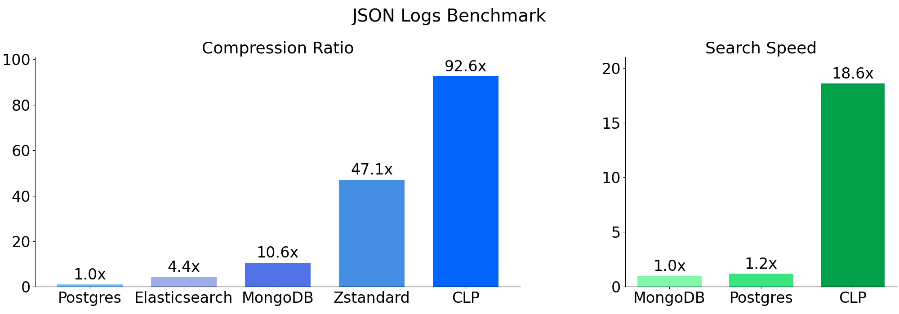

 

YScope's Compressed Log Processor (CLP) compresses your logs, and allows you to search the
compressed logs without decompression. CLP supports both JSON logs and unstructured (i.e., free
text) logs. It also supports real-time log compression within several logging libraries. CLP also
includes purpose-built web interfaces for searching and viewing the compressed logs. To learn more
about it, you can read our [paper][9].

# Benchmarks

The figures above show CLP's compression and search performance compared to other tools. We separate
the experiments between JSON and unstructured logs because (1) some tools can only handle one type
of logs, and (2) tools that can handle both types often have different designs for each type (such
as CLP).

Compression ratio is measured as the average across a variety of log datasets. Some of these
datasets can be found [here][1]. Search performance is measured using queries on the
MongoDB logs (for JSON) and the Hadoop logs (for unstructured logs). Note that CLP uses an
index-less design, so for a fair comparison, we disabled MongoDB and PostgreSQL's indexes; If we
left them enabled, MongoDB and PostgreSQL's compression ratio would be worse. We didn't disable
indexing for Elasticsearch or Splunk since these tools are fundamentally index-based (i.e., logs
cannot be searched without indexes). More details about our experimental methodology can be found in
the [CLP paper][9].

# System Overview

CLP provides an end-to-end log management pipeline consisting of compression, search, analytics, and
viewing. The figure above shows the CLP ecosystem architecture. It consists of the following
features:

- **Compression and Search**: CLP compresses logs into archives, which can be searched and analyzed
  in a [web UI](components/webui). The input can either be raw logs or CLP's compressed IR
  (intermediate representation) produced by CLP's logging libraries.

- **Real-time Compression with CLP Logging Libraries**: CLP provides logging libraries for
  [Python][10] and Java ([Log4j][11] and [Logback][12]). The logging libraries compress logs in
  real-time, so only compressed logs are written to disk or transmitted over the network. The
  compressed logs use CLP's intermediate representation (IR) format which achieves a higher
  compression ratio than general purpose compressors like Zstandard. Compressing IR into archives
  can further double the compression ratio and enable global search, but this requires more memory
  usage as it needs to buffer enough logs. More details on IR versus archives can be found in this
  [Uber Engineering Blog][13].

- **[Log Viewer][14]**: the compressed IR can be viewed in a web-based log viewer. Compared to
  viewing the logs in an editor, CLP's log viewer supports advanced features like filtering logs
  based on log level verbosity (e.g., only displaying logs with log level equal or higher than
  ERROR). These features are possible because CLP's logging libraries parse the logs before
  compressing them into IR.

- **IR Analytics Libraries**: we also provide a [Python library][15] and a [Go library][16] that can
  analyze compressed IR.

- **[Log parser][17]**: CLP also includes a custom pushdown-automata-based log parser that is 3x
  faster than state-of-the-art regular expression engines like [RE2][18]. The log parser is
  available as a library that can be used by other applications.

# Getting Started

You can download a [release package](https://github.com/y-scope/clp/releases) which includes support
for distributed compression and search. Or, to quickly try CLP's *core* compression and search, you
can use a [prebuilt container][2].

We also have guides for building the [package][3] and [CLP core][4] from source.

For some logs you can use to test CLP, check out our open-source [datasets][1].

# Providing Feedback

You can use GitHub issues to [report a bug][5] or [request a feature][6].

Join us on [Zulip][7] to chat with developers and other community members.

# Next Steps

This is our open-source release which we will be constantly updating with bug fixes, features, etc.
If you would like a feature or want to report a bug, please file an issue and we'll be happy to engage.

[1]: https://docs.yscope.com/clp/main/user-guide/resources-datasets.html
[2]: http://docs.yscope.com/clp/main/user-guide/core-container.html
[3]: http://docs.yscope.com/clp/main/dev-guide/building-package.html
[4]: http://docs.yscope.com/clp/main/dev-guide/building-core.html
[5]: https://github.com/y-scope/clp/issues/new?assignees=&labels=bug&template=bug-report.yml
[6]: https://github.com/y-scope/clp/issues/new?assignees=&labels=enhancement&template=feature-request.yml
[7]: https://yscope-clp.zulipchat.com/
[9]: https://www.usenix.org/system/files/osdi21-rodrigues.pdf
[10]: https://github.com/y-scope/clp-loglib-py
[11]: https://github.com/y-scope/log4j1-appenders
[12]: https://github.com/y-scope/logback-appenders
[13]: https://www.uber.com/en-US/blog/reducing-logging-cost-by-two-orders-of-magnitude-using-clp
[14]: https://github.com/y-scope/yscope-log-viewer
[15]: https://github.com/y-scope/clp-ffi-py
[16]: https://github.com/y-scope/clp-ffi-go
[17]: https://github.com/y-scope/log-surgeon
[18]: https://github.com/google/re2
