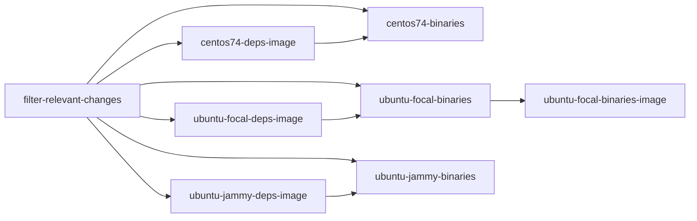

# GitHub Workflows

The CLP repo includes several GitHub workflows for automating container image builds, artifact
builds, testing, and linting. We briefly describe each workflow below.

## [clp-core-build](../.github/workflows/clp-core-build.yaml)

This workflow is responsible for:

1. building (Linux) container images containing CLP-core's dependencies, and
2. building CLP-core and running its unit tests.

To minimize build times, the jobs in the workflow are organized in the directed acyclic graph (DAG)
shown below.

Arrows between jobs indicate a dependency. The jobs are as follows:

* `filter-relevant-changes`: Filters the changes in the pull request or commit to determine which of
  the following jobs should run.
* `centos74-deps-image`: Builds a container image containing the dependencies necessary to build
  CLP-core in a CentOS 7.4 x86 environment.
* `ubuntu-focal-deps-image`: Builds a container image containing the dependencies necessary to build
  CLP-core in an Ubuntu Focal x86 environment.
* `ubuntu-jammy-deps-image`: Builds a container image containing the dependencies necessary to build
  CLP-core in an Ubuntu Jammy x86 environment.
* `centos74-binaries`: Builds the CLP-core binaries in the built CentOS 7.4 container and runs
  core's unit tests.
* `ubuntu-focal-binaries`: Builds the CLP-core binaries in the built Ubuntu Focal container and runs
  core's unit tests.
* `ubuntu-jammy-binaries`: Builds the CLP-core binaries in the built Ubuntu Jammy container and runs
  core's unit tests.
* `ubuntu-focal-binaries-image`: Builds an Ubuntu Focal container image containing CLP-core's
  binaries built in the `ubuntu-focal-binaries` job.

When the PR or commit doesn't change any of the files that affect CLP's dependencies (or the
dependency container images), then the dependency container images won't be rebuilt; instead the
published images (from ghcr.io) will be used.

If a PR or commit *does* change the dependencies, then the relevant dependency image(s) will be
rebuilt, and those will be used by the dependent jobs. Specifically, if the change is from a commit,
the image(s) will be published to ghcr.io and then dependent jobs will pull the image(s) from there.
If the change is from a PR, the image(s) will be uploaded to temporary storage provided by GitHub
Actions, and then dependent jobs will download and load the image(s) from there.

Note that for the images containing CLP's dependencies (built by the `xxx-deps-image` jobs), we need
to build and test an image for each Linux distro where we support building CLP natively. However,
for the image containing CLP's binaries (built by the `ubuntu-focal-binaries-image` job), we only
need it for one OS since users can use the container on any OS.

## [clp-core-build-macos](../.github/workflows/clp-core-build-macos.yaml)

This workflow builds CLP-core on macOS and runs its unit tests.

## [clp-execution-image-build](../.github/workflows/clp-execution-image-build.yaml)

This workflow builds a container image that contains the dependencies necessary to run the CLP
package.

## [clp-lint](../.github/workflows/clp-lint.yaml)

This workflow runs linting checks on the codebase.
