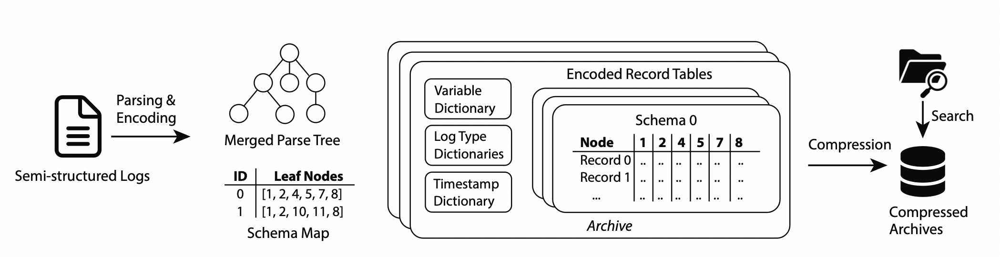
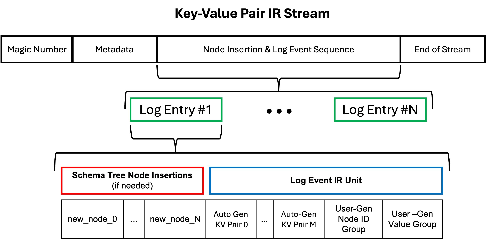
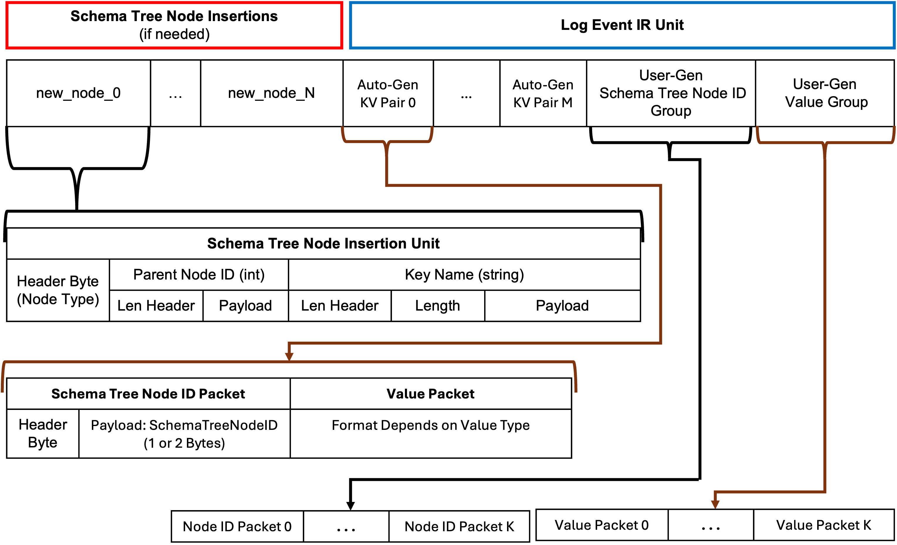

# Key-Value Pair IR Stream

Key-Value Pair IR Stream is a new intermediate representation format for CLP-S that supports both 
semi-structured logs and unstructured logs. Here we will walk through the technical details of this
key step forward for CLP-S. At a high level, we use a streaming format to represent the 
semi-structured data. The stream consists of some initial metadata, followed by series data segments
that we call IR units. These units come in three types: schema tree node insertion units, log event 
units, and an end-of-stream unit. Here we will talk through this streaming format, how it was 
developed, and how this intermediary representations works with the CLP-S archive format.

## Introduction

As outlined in [Uber's blog post][uber-blog] from 2022, the 
[CLP IR stream format](#background-in-clp-intermediary-representation-clp-ir-format) is a 
lightweight serialization format designed for log streaming compression. However, due to its design 
constraints, this IR stream format is primarily suited for simple, unstructured logs, such as raw 
text logs, which typically consist of only a timestamp field and a log message field. Consequently, 
structured logs, such as JSON logs, cannot be efficiently serialized using this format.

[CLP-S][clp-s-osdi] is an extension of the CLP's design principle but applied to semi-structured 
logs such as JSON. It uses the key-value structure of JSON entries, to define what type of log a 
JSON entry is by breaking the log message down into keys, types, and values. Take the log event 
below in Figure 1, as an example. In the log event #1, "log_id" would be a key and the corresponding
variable would be an Integer with the value of 2648. You can see the full break down of key, type, 
and value in Figure #2. You can find a list of the types use by CLP-S 
[here](#appendix-clp-s-schema-tree-types).

<table style="border-collapse: collapse; width: 50%;" align="center">
<tr>
    <th style="border: 1px solid black; text-align:center;">Log Event #1</th>  
</tr>
<tr>
    <td style="border: 1px solid black; vertical-align: top;">
        <pre>
{
  "log_id": 2648,
  "version_num": 1.01,
  "has_error": true,
  "msg": "ERROR: CPU usage: 99.99%",
  "other_info": {}
}
        </pre>
    </td>
</tr>
</table>

<strong>Figure 1</strong>: Log Event #1

//TODO: Set column widths <!--><td width="x%"></td><-->

<table style="border-collapse: collapse; width: 60%;" align="center">
<tr>
  <th>Key</th>
  <th>Type</th>
  <th>Value</th>
</tr>
<tr>
  <td>"log_id"</td>
  <td>Integer</td>
  <td>2648</td>
</tr>
<tr>
  <td>"version_num"</td>
  <td>Float</td>
  <td>1.01</td>
</tr>
<tr>
  <td>"has_error"</td>
  <td>Boolean</td>
  <td>true</td>
</tr>
<tr>
  <td>"msg"</td>
  <td>ClpString</td>
  <td>"ERROR: CPU usage: 99.99%"</td>
</tr>
<tr>
  <td>"other_info"</td>
  <td>Object</td>
  <td>{}</td>
</tr>
</table>

<strong>Figure 2</strong>: Key, Types, and Values for Log Event #1

The table from Figure 2 can be represented as a tree. When a unique key name and type pair is 
encountered, we add a new leaf node to the tree. The internal nodes of the tree are any surrounding 
objects. If two keys share the same name, but differ in type, we add that new node to the tree. We 
call this a schema tree. Consider log event #1 from Figure 1. For the first element in log event #1,
the schema tree would need to contain a leaf node with the name “log_id” and the type integer. 
Following that process for the entire log event you would construct the schema tree in Figure 3.

<strong>Figure 3</strong>: CLP-S schema tree for log event #1

A schema is a unique set of leaf nodes from a schema tree used by a given log event. A log event can
be uniquely encoded with a combination of a schema and a set of values to "fill in the blanks" of 
that schema. For log event #1 its schema for be <strong>[1, 2, 3, 4, 5]</strong>, the list of node 
ids for the leaf nodes in its schema tree from Figure #3. 

Now lets add the following log event (Figure #4). Like we just did with log event one we could build
a schema tree for just this log event, but if you compare log event #1 and log event #2, they share 
a number of the same key and types pairs. To save space we merge the schema trees of all logs 
together, so we don't need to maintain duplicate nodes. We call this a merged schema tree. You can 
see the merged schema tree for these two log events in Figure 5.

<table style="border-collapse: collapse; width: 50%;" align="center">
<tr>
    <th style="border: 1px solid black; text-align:center;">Log Event #2</th>  
</tr>
<tr>
    <td style="border: 1px solid black; vertical-align: top;">
        <pre>
{
  "log_id": 2649,
  "version_num": 1.01,
  "has_error": false,
  "msg": "success",
  "other_info": {
    "result": [11, 21, 31]
  }
}
        </pre>
    </td>
</tr>
</table>

<strong>Figure 4</strong>: Log Event #2

<strong>Figure 5</strong>: CLP-S Merged Schema Tree

Notice when merging the schema trees for each log event together that you have all the nodes from 
log event #1 schema tree, but we have added 2 node to the merged schema tree to support Log Event 
#2. We added a second node(#6) with the key of "msg", but with a different type since CLP-S encodes 
strings with and without whitespace differently. We also added the node #7 for the new "result" key,
which becomes a child of node #5 which is the object surrounding it. This means that the schema for 
log event #2 is <strong>[1,2,3,6,7]</strong>. Notice that node #5 is not listed in teh schema for 
Log Event #2, because it is not a leaf node there. 

Since a schema just represents set of key and type pairs and not the values, with additional log 
events, each of the schemas may correspond to more than one log event. To deduplicate these schemas,
we maintain a table of all the unique schemas called a schema map. 

<table style="border-collapse: collapse; text-align: center; width: 50%;">
<tr>
<td><strong>Schema ID</strong></td> <td><strong>Nodes in Schema</strong></td>
</tr>
<tr>
<td>0</td>
<td>
[1, 2, 3, 4, 5]
</td>
</tr>
<tr>
<td>1</td>
<td>[1, 2, 3, 6, 7]</td>
</tr>
</table>

<strong>Figure 6</strong>: CLP-S Schema Map (Nodes unique to a log 
event are highlighted)

Using this schema map we can encode a log event as the Schema ID and the list of values. Like in CLP
these values can are further deduplicated using dictionaries. You can see an overall 
CLP-S workflow in Figure 7 and you can read further details here; 
[OSDI24 - wang et. al][clp-s-osdi]. 

<strong>Figure 7</strong>: Figure 7 from μSlope: High Compression and
 Fast Search on Semi-Structured Logs by Wang et al.

Building upon the principles of the existing IR stream format and drawing inspiration from CLP-S, 
we have developed a new IR format: we call Key-Value Pair IR Stream format. This new format 
enhances the original design by efficiently supporting key-value pair serialization, thereby 
addressing the limitations of the previous IR format.

This new IR format has been successfully deployed in production environments to serialize 
real-world log events for cost reduction. These log events originate from diverse sources, 
including:
- Application and services logs in data centers.
- User, application, and FSD (full self-driving) operational logs on electrical vehicles on the 
  road.

## Design Overview

Our goal for Key-Value Pair IR Stream (KV Pair IR) is to break CLP-S into phases, like we did for 
CLP with CLP IR, so that we can still achieve a substantial amount of initial compression, but leave
the heavy resource intensive deduplication of schemas and variable values for later processing. Like
CLP IR, KV Pair IR enables the lossless compression of logs on an entry by entry basis. KV Pair IR 
is a superset of CLP IR, expanding on the CLP IR structure to support more types of variables and 
logs suited for managing semi-structured logs like JSON. Rather than needing the entire log file in 
order to compress, KV Pair IR can be built one log entry at a time. Like CLP-S, KV Pair IR utilizes 
a schema tree format, but the schema trees use a simplified set of types: string, integer, float, 
boolean, unstructured arrays, and objects. These types can map to multiple CLP-S types, but keeping 
a simplified list of types limits any specialization to the archive. In addition to a schema tree 
built from the user-generated structured logs such as JSON, KV Pair IR also supports auto-generated 
key-value pairs which allows the automatic tracking of useful logging metadata such as timestamp,log
level, machine info, etc.

### Auto-generated kv-pairs vs. User-generated kv-pairs

KV Pair IR categorizes the kv-pairs of a log event into two categories:
- **Auto-generated kv-pairs**: KV-pairs (e.g., timestamps, log levels, other metadata) that are
  automatically generated by the logging library.
- **User-generated kv-pairs**: Custom kv-pairs (e.g., log messages).

<table style="border-collapse: collapse; width: 100%;">
<tr>
    <th></th>
    <th style="border: 1px solid black;">Log Event #1</th>  
    <th style="border: 1px solid black;">Log Event #2</th>  
</tr>
<tr>
    <td>User-Generated</td>
    <td style="border: 1px solid black; vertical-align: top;">
        <pre>
{
  "log_id": 2648,
  "version_num": 1.01,
  "has_error": true,
  "msg": "ERROR: CPU usage: 99.99%",
  "other_info": {},
  "timestamp": "Jan 1, 2025 @ 3:45pm"
}
        </pre>
    </td>
    <td style="border: 1px solid black; vertical-align: top;">
        <pre>
{
  "log_id": 2649,
  "version_num": 1.01,
  "has_error": false,
  "msg": "success",
  "other_info": {
    "result": [11, 21, 31]
  }
  "timestamp": "Jan 1, 2025 @ 4:23pm"
}
        </pre>
    </td>
</tr>
<tr>
    <td>Auto-Generated</td>
    <td style="border: 1px solid black; vertical-align: top;">
        <pre>
  "timestamp": "2025-01-01T15:45:00+00:00"
  "machine_num": 123
        </pre>
    </td>
    <td style="border: 1px solid black; vertical-align: top;">
        <pre>
  "timestamp": "2025-01-01T16:23:00+00:00"
  "machine_num": 123
        </pre>
    </td>
</tr>
</table>

<strong>Figure 8</strong>: Example Log Events

Auto-generated (auto-gen) keys can be used to automate the adding of information such as timestamps,
log level, machine information, etc. to all of you log messages for consistency.
Each KV Pair IR stream maintains auto-gen keys and user-generated (user-gen) keys in two independent
schema trees, ensuring clear differentiation and avoiding unintended interference. This design 
prevents conflicts between auto-gen and user-gen keys by keeping them separate. 
For example if your log message was already maintaining a local timestamp string called "timestamp" 
inside the JSON log message, but you wanted the logging library to track a separate UTC timestamp 
string and call it "timestamp". While you could try to find an unused key name, by keeping the 
auto-gen key in a separate schema tree, it allows this auto-gen key to have whatever name you 
want and not conflict with the "timestamp" already in use or with any future key that you haven't 
encountered yet. Maintaining the trees separately also allows us to encode the auto-gen keys and 
values in the stream differently than the user-gen keys and values which, as we will explain later, 
improves compression rates in the IR stream.
//ToDo: Are there other benefits ... in querying?

**NOTE**: CLP-S does not currently support auto-generated key-value pairs and will not be reflected 
in the CLP-S archive generated from a Key-Value Pair IR Stream containing auto-generated keys.

### Key-Value Pair IR Schema Tree

As we mentioned above, KV Pair IR uses a schema tree which is similar, but simplified from CLP-S. 
Each schema tree node still has a unique ID and a defined type, but we utilize a smaller set of 
types. You can find the full list of KV Pair types [here](#value-packets) and how they translate to 
CLP-S types [here](#appendix-key-value-pair-ir-stream-types-translations-to-clp-s-types). Like in 
CLP-S, log events can be encoded as a schema, which is a set of leaf node IDs that represents the 
key name and type, and the values that correspond to that schema from the log message. Considering 
the log events from Figure 8, Figure 9 and 10 contains the two schema trees, and Figure 11 contains 
the schemas used by KV Pair IR.

<strong>Figure 9</strong>: Key-Value Pair IR User-Generated Schema 
Tree

<strong>Figure 10</strong>: Key-Value Pair IR Auto-Generated Schema 
Tree

<table style="border-collapse: collapse; text-align: center; width: 70%;">
<tr>
<td></td>
<td><strong>Auto-Generated Schema</strong></td> <td><strong>User-Generated Schema</strong></td>
</tr>
<tr>
<td>Log Event #1</td>
<td>[1, 2]</td>
<td>[1, 2, 3, 4, 5,6]</td>
</tr>
<tr>
<td>Log Event #2</td>
<td>[1, 2]</td>
<td>[1, 2, 3, 4, 6, 7]</td>
</tr>
</table>

<strong>Figure 11</strong>: CLP-S Schema Map (Nodes unique to a log 
event are highlighted)

### Building Schema Tree In A Stream

Using the [schema trees](#schema-tree), how can we build the schema trees one log event at 
a time to enable a serialized streamable format similar to CLP IR? We do this by breaking each 
log event down into a series schema tree node insertion packets describing changes in 
the schema tree and key and value packets which represent the schema and the corresponding values 
for the log event. Although we will use the terminology IR packets to describe the individual IR 
stream elements, all of the IR packets corresponding to a single log event would be sent in a single
network packet to preserve the order of the individual elements, since the order and location of 
these pieces in the stream are used inherently by the future log events. 

### IR Stream

<strong>Figure 12</strong>: Key-Value Pair IR Stream Overview

So the overall format of the IR stream consists of 4 sections:
- [**Magic Number**](#magic-number) - which indicates the stream is a KV Pair Stream and how many 
byte encoding is being used
- [**Metadata**](#metadata) - which provides information necessary to properly deserialize the 
stream later
- **Node Insertion & Log Event Sequence** - an alternating set of 
[schema tree node insertion units](#schema-tree-node-insertion-unit) 
and a set of schema tree node id packets and value packets we call a 
[log event IR unit](#log-event-unit) 
- [**End-of-Stream**](#end-of-stream-unit) - a packet to indicate you've reached the end of a valid 
KV Pair IR Stream. 

The bulk of the stream will be in spent in that alternating set of schema tree node insertions and 
log event IR units, as the stream contains one set for each log message. The log event unit contains
a set of 
[schema node ID IR packets and value IR packets](#auto-generated-schema-tree-node-id-value-pairs) 
for the auto-gen schema nodes, and then a set of 
[schema node ID and corresponding value IR packets](#user-generated-schema-tree-node-id-value-pairs)
for each user-gen key-value pair in the log entry. 

Lets try encoding and serializing the two log events from Figure 8 into a KV-Pair Stream.

#### Magic Number
The magic number identifies the stream as a valid KV Pair IR Steam and tells use whether we are 
using 4 byte or 8 byte encoding. Let's say we are using 4 byte encoding. Then our stream will need 
to start with Figure 13. You can read about the other magic number values in the 
[magic number](#magic-number-1) section of the specification below.

<table style="border-collapse: collapse; text-align: center; width: 40%; color: black">
    <td style="border: 1px solid black; vertical-align: top; background-color: white">
{0xFD, 0x2F, 0xB5, 0x29}
    </td>
</table>

<strong>Figure 13</strong>: Magic Number - Beginning of IR Stream 

#### Metadata
The next section is the metadata section. This will consist of a single packets which contains some 
key value pairs, whose values are necessary to correctly deserialize and decode they stream later. 
You can find the list of necessary key value pairs in the [metadata](#metadata-1) section below. You
can see a metadata packet for our example stream with all required fields in Figure 14.

//TODO Complete example metadata packet
:::{mermaid}
%%{init: {'theme':'neutral'}}%%
block-beta
    columns 1
    A["Header Byte"]:1
:::

<strong>Figure 14</strong>: Metadata Packet

#### Node Insertion & Log Event Sequence

<strong>Figure 15</strong>: Node Insertion and Log Entry Sequence

The majority of the stream is spent in this section. It follows the same pattern for every log entry.

1. [Schema Tree Node Insertion Units](#schema-tree-node-insertion-unit) - One for each new schema 
nodes added to the schema tree by this log event. If there are not any new nodes than there won't be
any node insertion units.
2. [Schema Tree Node ID Packet](#schema-tree-node-locator-packet) and [Value Packet](#value-packets)
Pairs for auto generated log elements
3. [Schema Tree Node ID Packets](#schema-tree-node-locator-packet)  for all the user generated log 
elements
4. [Value Packet](#value-packets) for all the user generated log elements

##### Schema Tree Node Insertion Units
[Schema Tree Node Insertion Units](#schema-tree-node-insertion-unit) indicate when there is a new 
node being added to the schema tree. These packets are what allow us to build the schema tree and 
thus the stream one log entry at a time. 

<strong>Figure 16</strong>: Schema Tree Node Insertion Packet

This unit consists of 3 parts:
1. **Header Byte** - Indicates both that this packet is inserting a node into the tree as well as 
the type of the node being added.
2. **Parent Node ID** - The node ID of parent schema node for the new node being inserted. This 
tells you where in the tree the new node belongs.
3. **Key Name** - This is the name of the node.

We assume the schema trees have a root node with the node id of 0, so we don't need to stream the 
root nodes. 

:::{mermaid}
%%{init: {'theme':'neutral'}}%%
block-beta
columns 6
  A1["Schema Tree"]:2
  B1["Auto Generated Key"]:2
  C1["User Generated Key"]:2
  A2["Encoded ID"]:2
  block:group1:2
    columns 4
    B2_1["..."]
    B2_2["-3"]
    B2_3["-2"]
    B2_4["-1"]
  end
  block:group2:2
    columns 4
    C2_1["0"]
    C2_2["1"]
    C2_3["2"]
    C2_4["..."]
  end
  A3["Actual ID"]:2
  block:group3:2
    columns 4
    B3_1["..."]
    B3_2["2"]
    B3_3["1"]
    B3_4["0"]
  end
  block:group4:2
    columns 4
    C3_1["0"]
    C3_2["1"]
    C3_3["2"]
    C3_4["..."]
  end
:::

<strong>Figure 17</strong>: Auto-gen and User-gen Schema Tree Node ID 
Encoding

To distinguish between the auto-gen and user-gen nodes, we encode the node ID of the auto-gen nodes 
using 1's complement. For example when we add a node whose parent's node ID is 0, it means the node 
is being added to the user-gen schema tree and the parent is the root. If we wanted to add a node to
the root of the auto-gen schema tree we would have to set its parent ID to -1. The index in the 
stream relative to the other node insertion packets is what defines it's ID. So if the node 
insertion is the 4th user-gen node insertion in the stream then it's ID is 4 or if the node was the 
4th auto-gen node inserted it's ID would be 4, but it would be encoded as -5. You can see the 
encoding ID pattern in Figure 17.

Lets encode the insertion of a Integer node named "log_id" whose parent is the user-gen root. To 
find the correct Header Bytes we can use the 
[Packet Header Bytes Table](#appendix-ir-packet-header-bytes) in the Appendix. 

<table style="border-collapse: collapse; text-align: center; width: 100%; color: black">
<tr>
  <td style="border: 1px solid black; vertical-align: top; background-color: white">
Header Byte (Node Type)
  </td>
  <td style="border: 1px solid black; vertical-align: top; background-color: white">
Parent Node ID Length Header (1, 2, or 4 bytes)
  </td>
  <td style="border: 1px solid black; vertical-align: top; background-color: white">
Parent Node ID
  </td>
  <td style="border: 1px solid black; vertical-align: top; background-color: white">
Key Name Length Header (1, 2, or 4 bytes)
  </td>
  <td style="border: 1px solid black; vertical-align: top; background-color: white">
Key Name Length
  </td>
  <td style="border: 1px solid black; vertical-align: top; background-color: white">
Key Name
  </td>
</tr>
<tr>
  <td style="border: 1px solid black; vertical-align: top; background-color: white">
0x71 (Integer)
  </td>
  <td style="border: 1px solid black; vertical-align: top; background-color: white">
0x60 (1 Byte)
  </td>
  <td style="border: 1px solid black; vertical-align: top; background-color: white">
0
  </td>
  <td style="border: 1px solid black; vertical-align: top; background-color: white">
0x65 (1 Byte)
  </td>
  <td style="border: 1px solid black; vertical-align: top; background-color: white">
6
  </td>
    <td style="border: 1px solid black; vertical-align: top; background-color: white">
"log_id"
  </td>
</tr>
</table>

<strong>Figure 18</strong>: Example Schema Node Insertions 

Since this encoding is quite long to write out in full, we are going to use the types name to 
represent the Header Bytes, an integer to represent the parent ID, and a string to represent the key
name encoding. Let do the node insertions for Log Event #1 from Figure 8. 

<table style="border-collapse: collapse; text-align: center; width: 100%; color: black">
  <td><pre style="border: 1px solid black; vertical-align: top; color: black; 
  background-color: white">
Integer
0
"log_id"</pre></td>
    <td><pre style="border: 1px solid black; vertical-align: top; color: black; 
    background-color: white">
Float
0
"version_num"</pre></td>
    <td><pre style="border: 1px solid black; vertical-align: top; color: black; 
    background-color: white">
Boolean
0
"has_error"</pre></td>
    <td><pre style="border: 1px solid black; vertical-align: top; color: black; 
    background-color: white">
String
0
"msg"</pre></td>
    <td><pre style="border: 1px solid black; vertical-align: top; color: black; 
    background-color: white">
Object
0
"other_info"</pre></td>
    <td><pre style="border: 1px solid black; vertical-align: top; color: black; 
    background-color: white">
String
0
"timestamp"</pre></td>
</table>

<strong>Figure 19</strong>: User-Gen Schema Node Insertions 

<table style="border-collapse: collapse; text-align: center; width: 33%; color: black">
  <td><pre style="border: 1px solid black; vertical-align: top; color: black; 
  background-color: white">
String
-1
"timestamp"</pre></td>
  <td><pre style="border: 1px solid black; vertical-align: top; color: black; 
  background-color: white">
String
-1
"machine_num"</pre></td>
</table>

<strong>Figure 20</strong>: Auto-Gen Schema Node Insertions 

Now that we have all the necessary nodes for Log Event #1 in the stream, we can encode the log event
itself. We need to encode the auto-gen values and the user-gen values. Remember when we talks about 
schema trees we said a log event could be encoded using its schema (a list of leaf node IDs), and 
the schema's corresponding values. 

- [Auto-Gen Encoding](#auto-generated-schema-tree-node-id-value-pairs) - The auto-gen portion of 
the log event will be encoded in Node-ID packet and Value packet pairs.
- [User-Gen Encoding](#user-generated-schema-tree-node-id-value-pairs) -  The user-gen portion of 
the log event will be encoded with all the Node-ID packets and then all the Value packets. 
  
These kv pairs are encoded differently because we found that auto-gen and user-gen values behave 
differently, so using different orderings in the stream produces better compression rates. Since the
auto-gen values are often similar or the same over many log events that we got better compression by
keeping the node ID and the value together to make a longer common string for compression. User-gen 
values have more variability, but the user-gen portion may have the same schema over many log 
events, so keeping the node IDs and values grouped separately seemed to yield the best compression 
rates. Although grouped differently we will use the same node ID and value packets for both the 
auto-gen and user-gen portions.

- [Node ID Packet](#encoded-schema-tree-node-id-packet) - contains (1) a Header Byte indicating 
that this is a Node ID Packet and whether the key is 1, 2, or 4 bytes; (2) the Node ID

- [Value Packets](#value-packets) - always contains a Header Byte that indicates its a value packet 
and the type of the value it contains (e.g. integer, float, etc.). The rest of the packet differs 
based on the type of the value. You can see a full list and specifications in the 
[Value Packets Section](#value-packets) below.

Let's encode the auto-gen and user-gen kv pair portions of Log Event #1 from Figure 8. Like we did 
with the insertion packets above we are going to similarly abbreviate these packet. 

<table style="border-collapse: collapse; text-align: center; width: 100%; color: black">
  <td><pre style="border: 1px solid black; vertical-align: top; color: black; 
  background-color: white">
Node ID (1 Byte) 
ID = -2</pre></td>
  <td><pre style="border: 1px solid black; vertical-align: top; color: black; 
  background-color: white">
String
Length = 25
"2025-01-01T15:45:00+00:00"</pre></td>
  <td><pre style="border: 1px solid black; vertical-align: top; color: black; 
  background-color: white">
Node ID (1 Byte)
ID = -3</pre></td>
  <td><pre style="border: 1px solid black; vertical-align: top; color: black; 
  background-color: white">
Integer (1 Byte)
123</pre></td>
</table>

<strong>Figure 21</strong>: Log Event #1 Auto-Gen KV Pairs 

<table style="border-collapse: collapse; text-align: center; width: 100%; color: black">
    <td><pre style="border: 1px solid black; vertical-align: top; color: black; 
    background-color: white">
Node ID (1 Byte) 
ID = 1</pre></td>
    <td><pre style="border: 1px solid black; vertical-align: top; color: black; 
    background-color: white">
Node ID (1 Byte) 
ID = 2</pre></td>
    <td><pre style="border: 1px solid black; vertical-align: top; color: black; 
    background-color: white">
Node ID (1 Byte) 
ID = 3</pre></td>
    <td><pre style="border: 1px solid black; vertical-align: top; color: black; 
    background-color: white">
Node ID (1 Byte) 
ID = 4</pre></td>
    <td><pre style="border: 1px solid black; vertical-align: top; color: black; 
    background-color: white">
Node ID (1 Byte) 
ID = 5</pre></td>
    <td><pre style="border: 1px solid black; vertical-align: top; color: black; 
    background-color: white">
Node ID (1 Byte) 
ID = 6</pre></td>
</table>

<strong>Figure 22</strong>: Log Event #1 User-Gen Node ID Group 

<table style="border-collapse: collapse; text-align: center; width: 100%; color: black">
    <td><pre style="border: 1px solid black; vertical-align: top; color: black; 
    background-color: white">
Integer (1 Byte)
2648</pre></td>
    <td><pre style="border: 1px solid black; vertical-align: top; color: black; 
    background-color: white">
Float (8 Byte)
1.01</pre></td>
    <td><pre style="border: 1px solid black; vertical-align: top; color: black; 
    background-color: white">
True</pre></td>
    <td><pre style="border: 1px solid black; vertical-align: top; color: black; 
    background-color: white">
Four Byte Encoded Text AST
"ERROR: CPU usage: 99.99%"</pre></td>
    <td><pre style="border: 1px solid black; vertical-align: top; color: black; 
    background-color: white">
Empty Object</pre></td>
    <td><pre style="border: 1px solid black; vertical-align: top; color: black; 
    background-color: white">
Four Byte Encoded Text AST 
"Jan 1, 2025 @ 3:45pm"</pre></td>
</table>

<strong>Figure 23</strong>: Log Event #1 User-Gen Value Group 

Now we have completed encoding one full log event. //ToDo ... Discussion?? Let's add Log Event #2 
from Figure 8 to the stream. For Log Event #2 we only have to add one node to the user-gen schema 
tree and none to the auto-gen schema tree, so the node insertions portion is going to be a lot 
smaller.

<table style="border-collapse: collapse; text-align: center; width: 30%; color: black">
    <td><pre style="border: 1px solid black; vertical-align: top; color: black; 
    background-color: white">
Unstructured Array
Parent NodeID = 5
"result"</pre></td>
</table>

<strong>Figure 24</strong>: Log Event #2 User-Gen Schema Node Insertions 

<table style="border-collapse: collapse; text-align: center; width: 100%; color: black">
  <td><pre style="border: 1px solid black; vertical-align: top; color: black; 
  background-color: white">
Node ID (1 Byte) 
ID = -2</pre></td>
  <td><pre style="border: 1px solid black; vertical-align: top; color: black; 
  background-color: white">
String
Length = 25
"2025-01-01T16:23:00+00:00"</pre></td>
  <td><pre style="border: 1px solid black; vertical-align: top; color: black; 
  background-color: white">
Node ID (1 Byte)
ID = -3</pre></td>
  <td><pre style="border: 1px solid black; vertical-align: top; color: black; 
  background-color: white">
Integer (1 Byte)
123</pre></td>
</table>

<strong>Figure 25</strong>: Log Event #2 Auto-Gen KV Pairs 

<table style="border-collapse: collapse; text-align: center; width: 100%; color: black">
    <td><pre style="border: 1px solid black; vertical-align: top; color: black; 
    background-color: white">
Node ID (1 Byte) 
ID = 1</pre></td>
    <td><pre style="border: 1px solid black; vertical-align: top; color: black; 
    background-color: white">
Node ID (1 Byte) 
ID = 2</pre></td>
    <td><pre style="border: 1px solid black; vertical-align: top; color: black; 
    background-color: white">
Node ID (1 Byte) 
ID = 3</pre></td>
    <td><pre style="border: 1px solid black; vertical-align: top; color: black; 
    background-color: white">
Node ID (1 Byte) 
ID = 4</pre></td>
    <td><pre style="border: 1px solid black; vertical-align: top; color: black; 
    background-color: white">
Node ID (1 Byte) 
ID = 6</pre></td>
    <td><pre style="border: 1px solid black; vertical-align: top; color: black; 
    background-color: white">
Node ID (1 Byte) 
ID = 7</pre></td>
</table>

<strong>Figure 26</strong>: Log Event #2 User-Gen Node ID Group 

<table style="border-collapse: collapse; text-align: center; width: 100%; color: black">
    <td><pre style="border: 1px solid black; vertical-align: top; color: black; 
    background-color: white">
Integer (1 Byte)
2649</pre></td>
    <td><pre style="border: 1px solid black; vertical-align: top; color: black; 
    background-color: white">
Float (8 Byte)
1.01</pre></td>
    <td><pre style="border: 1px solid black; vertical-align: top; color: black; 
    background-color: white">
False</pre></td>
    <td><pre style="border: 1px solid black; vertical-align: top; color: black; 
    background-color: white">
String
"Success"</pre></td>
    <td><pre style="border: 1px solid black; vertical-align: top; color: black; 
    background-color: white">
Four Byte Encoded Text AST 
"Jan 1, 2025 @ 4:23pm"</pre></td>
    <td><pre style="border: 1px solid black; vertical-align: top; color: black; 
    background-color: white">
Four Byte Encoded Text AST 
"[11, 21, 31]"</pre></td>
</table>

<strong>Figure 27</strong>: Log Event #2 User-Gen Value Group 

#### End-of-Stream
Now that we had completed encoding and serializing all of the log events into the KV Pair IR stream,
the only remaining packet we need to send is the [end-of-stream packet](#end-of-stream-unit). This 
packet just contains a Header Byte which indicates you have reached the end of the stream. All 
streams must end in this packet to be considered valid.

### Deserialization
//ToDo ... How much do we want to say here?

## IR Stream Specification

:::{mermaid}
%%{init: {'theme':'neutral'}}%%
block-beta
    columns 4
    A["Magic Number"]:1
    B["Metadata"]:1
    C["Schemas & Log Events"]:1
    D["End"]:1
:::

### Magic Number

The magic number is a byte sequence to identify a CLP Key-value Pair IR Stream.
- `{0xFD, 0x2F, 0xB5, 0x29}`: Indicating that encoded text ASTs are in four-byte encoding.
- `{0xFD, 0x2F, 0xB5, 0x30}`: Indicating that encoded text ASTs are in eight-byte encoding.

### Metadata

[Stream Level Metadata](#stream-level-metadata) serialized as a
[JSON Metadata Packet](#json-metadata-packet).

#### Stream Level Metadata

Each IR stream contains a stream-level metadata section at the beginning of the stream. The metadata
is represented by key-value pairs.

The mandatory fields:
- `"VERSION"`: The stream version, represented as a string.
- `"VARIABLES_SCHEMA_ID"`: The variable schema ID, represented as a string.
- `"VARIABLE_ENCODING_METHODS_ID"`: The variable encoding ID, represented as a string.

Optional fields:
- `"USER_DEFINED_METADATA"`: Custom metadata provided by the user, represented as key-value pairs.

### Schemas & Log Events

A variable-length sequence of:
- [Schema Tree Node Insertion Unit](#schema-tree-node-insertion-unit)
- [Log Event Unit](#log-event-unit)

Rules:
- The schema tree starts with only the root node.
- Every schema node referenced in a Log Event Unit must be defined first in a preceding Schema Tree
  Node Insertion Unit within the stream.

### End

A single [End-of-stream Unit](#end-of-stream-unit) marks the termination of the IR stream.

## IR Units

In this section, we will enumerate all valid IR units and their formats. Each unit consists of one
or more packets as defined in [IR Packets](#ir-packets).

Supported Units:
- [Schema Tree Node Insertion Unit](#schema-tree-node-insertion-unit)
- [Log Event Unit](#log-event-unit)
- [End-of-stream Unit](#end-of-stream-unit)

### Schema Tree Node Insertion Unit

:::{mermaid}
%%{init: {'theme':'neutral'}}%%
block-beta
    columns 2
    B["Schema Tree Node Locator Packet"]:2
:::

A Schema Tree Node Insertion Unit signifies the addition of a new schema tree node to a schema tree.
It consists of a single packet, which must be a
[Schema Tree Node Locator Packet](#schema-tree-node-locator-packet).

This IR unit contains the necessary information to:
- Locate a node in a schema tree.
- Determine whether the node should be inserted into the auto-generated or user-generated schema
  tree.

### Log Event Unit

A Log Event Unit represents a complete log event, including both auto-generated and user-generated
kv-pairs. These kv-pairs are serialized as schema-tree-node-ID-value pairs.

#### Log Event Unit Overall Format Layout

:::{mermaid}
%%{init: {'theme':'neutral'}}%%
block-beta
    columns 2
    A["Auto-generated Schema-tree-node-id-value Pairs"]:1
    B["User-generated Schema-tree-node-id-value Pairs"]:1
:::

A Log Event Unit is serialized in the following order:
1. Auto-generated schema-tree-node-ID-value pairs.
2. User-generated schema-tree-node-ID-value pairs.

### Efficient Serialization of Schema-Tree-Node-ID-Value Pairs

To optimize compression, the auto-generated and user-generated schema-tree-node-ID-value pairs are
structured differently during serialization.

### Auto Generated Schema Tree Node Id Value Pairs

:::{mermaid}
%%{init: {'theme':'neutral'}}%%
    block-beta
    columns 5
    A["Encoded Node ID #0"]:1
    B["Encoded Value #0"]:1
    C["..."]:1
    D["Encoded Node ID #n"]:1
    E["Encoded Value #n"]:1
:::

Auto-generated schema-tree-node-ID-value pairs are serialized as an array of
`{Encoded Node ID, Encoded Value}` pairs:
- `Encoded Node ID` must belong to the auto-generated schema tree.
- `Encoded Value` must be valid for their respective types.
- If no auto-generated kv-pairs exist, this array is empty.

### User Generated Schema Tree Node Id Value Pairs

:::{mermaid}
%%{init: {'theme':'neutral'}}%%
block-beta
columns 6
    A["Encoded Node ID #0"]:1
    B["..."]:1
    C["Encoded Node ID #n"]:1
    D["Encoded Value #0"]:1
    E["..."]:1
    F["Encoded Value #n"]:1
:::

User-generated schema-tree-node-ID-value pairs separate node IDs and values, ensuring the schema
remains a contiguous list of encoded node IDs, which enhances compression efficiency.
- `Encoded Node ID` must belong to the user-generated schema tree.
- `Encoded Value` must be valid for their respective types.
- The number of `Encoded Node ID` must match the number of `Encoded Value`.
- If no user-generated kv-pairs exist, the layout must contain a single
  [Empty Value Packet](#empty-value-packet).

#### Scheme-tree-node-id-value Pairs

A schema-tree-node-ID-value pair consists of:
- An [Encoded Schema Tree Node ID Packet](#encoded-schema-tree-node-id-packet).
- A value packet corresponding to the schema tree node type.

#### Value Packets
Each schema tree node type supports the following accepted value packets:
- **Integer**:
  - [Integer Value Packet](#integer-value-packet)
- **Float**:
  - [Float Value Packet](#float-value-packet)
- **Boolean**:
  - [True Value Packet](#true-value-packet)
  - [False Value Packet](#false-value-packet)
- **Object**:
  - [Empty Value Packet](#empty-value-packet)
  - [Null Value Packet](#null-value-packet)
- **String**:
  - Without whitespace - [String Value Packet](#string-value-packet)
  - With whitespace: 
    - [Four-byte Encoded Text AST Packet](#four-byte-encoded-text-ast-packet)
    - [Eight-byte Encoded Text AST Packet](#eight-byte-encoded-text-ast-packet)
- **Unstructured Array**: Convert to Json String and encode accordingly
  - [Four-byte Encoded Text AST Packet](#four-byte-encoded-text-ast-packet)
  - [Eight-byte Encoded Text AST Packet](#eight-byte-encoded-text-ast-packet)

### End-of-stream Unit

:::{mermaid}
%%{init: {'theme':'neutral'}}%%
block-beta
    columns 2
    B["End-of-stream Packet"]:2
:::

An End-of-stream Unit signifies the end of an IR stream. It consists of a single packet, which must
be an [End-of-stream Packet](#end-of-stream-packet).

#### Complete IR Stream

An IR stream must end with this IR unit to be considered complete. If an IR stream does not
terminate with this unit, it is considered incomplete.

## IR Packets

In this section, we will enumerate all valid IR packets and their formats. Each IR packet is
assigned with one or several header bytes that can be uniquely identified. Each header byte will be
given a unique string ID. To find the numerical value of these header bytes, check
[Appendix: IR Packet Header Bytes](#appendix-ir-packet-header-bytes).

- Supported Packets:
  - [Metadata Packet](#metadata-packet)
  - [JSON Metadata Packet](#json-metadata-packet)
  - [Schema Tree Node Locator Packet](#schema-tree-node-locator-packet)
  - [Encoded Schema Tree Node Parent ID Packet](#encoded-schema-tree-node-parent-id-packet)
  - [Encoded Schema Tree Node ID Packet](#encoded-schema-tree-node-id-packet)
  - [Integer Value Packet](#integer-value-packet)
  - [Float Value Packet](#float-value-packet)
  - [True Value Packet](#true-value-packet)
  - [False Value Packet](#false-value-packet)
  - [Null Value Packet](#null-value-packet)
  - [Empty Value Packet](#empty-value-packet)
  - [String Value Packet](#string-value-packet)
  - [Four-byte Encoded Text AST Packet](#four-byte-encoded-text-ast-packet)
  - [Eight-byte Encoded Text AST Packet](#eight-byte-encoded-text-ast-packet)
  - [Dictionary Variable Packet](#dictionary-variable-packet)
  - [Logtype Packet](#logtype-packet)
  - [Four-byte Encoded Variable Packet](#four-byte-encoded-variable-packet)
  - [Eight-byte Encoded Variable Packet](#eight-byte-encoded-variable-packet)
  - [End-of-stream Packet](#end-of-stream-packet)

### Metadata Packet

:::{mermaid}
%%{init: {'theme':'neutral'}}%%
block-beta
    columns 5
    A["Header Byte"]:1
    B["Length"]:2
    B["Payload: Metadata Byte Sequence"]:2
:::

A Metadata Packet consists of a header byte, an encoded length, and the payload bytes:

- Header Bytes: Specifies the length encoding type.
    - `MetadataLengthUByte`: The length is a 1-byte unsigned integer.
    - `MetadataLengthUShort`: The length is a 2-byte unsigned integer.
- Length: The unsigned integer representing the byte sequence's length, encoded in big-endian format
  as specified by the header.
- Payload: The actual metadata byte sequence.

### JSON Metadata Packet

:::{mermaid}
%%{init: {'theme':'neutral'}}%%
block-beta
    columns 3
    A["Header Byte"]:1
    B["JSON Metadata"]:2
:::

A JSON Metadata Packet consists of a header byte and the JSON metadata.

- Header Byte: Specifies the metadata encoding type, set to `MetadataJsonEncoding`.
- JSON Metadata: The metadata serialized as a JSON string. Must be a
  [Metadata Packet](#metadata-packet).

### Schema Tree Node Locator Packet

:::{mermaid}
%%{init: {'theme':'neutral'}}%%
block-beta
    columns 5
    A["Header Byte"]:1
    B["Schema Tree Node Parent ID"]:2
    C["Key"]:2
:::

- Header Byte: Specifies the schema tree node's type. Must be one of the following:
  - `SchemaTreeNodeInteger`: Integer type.
  - `SchemaTreeNodeFloat`: Float type.
  - `SchemaTreeNodeBoolean`: Boolean type.
  - `SchemaTreeNodeString`: String type.
  - `SchemaTreeNodeUnstructuredArray`: Unstructured-array type.
  - `SchemaTreeNodeObject`: Object type.
- Schema Tree Node Parent ID: The parent node ID in the schema tree, serialized as an
  [Encoded Schema Tree Node Parent ID Packet](#encoded-schema-tree-node-parent-id-packet).
- Key: The key of the node, serialized as a [String Value Packet](#string-value-packet)

### Encoded Schema Tree Node Parent ID Packet

:::{mermaid}
%%{init: {'theme':'neutral'}}%%
block-beta
    columns 3
    A["Header Byte"]:1
    B["Payload: Encoded Schema Tree Parent Node ID"]:2
:::

An Encoded Schema Tree Node Parent ID Packet consists of a header byte and an encoded schema tree
node parent ID payload:

- Header Byte: Specifies the schema tree node parent ID encoding type.
    - `ParentID_1byte`: Payload is a 1-byte one's complement integer.
    - `ParentID_2byte`: Payload is a 2-byte one's complement integer.
    - `ParentID_4byte`: Payload is a 4-byte one's complement integer.
- Payload: The schema tree node parent ID, encoded in big-endian format as specified by the header.
    - If the encoded ID is positive, it represents a node ID from the user-generated schema tree.
    - If the encoded ID is negative, its absolute value represents a node ID from the auto-generated
      schema tree.

### Encoded Schema Tree Node ID Packet

:::{mermaid}
%%{init: {'theme':'neutral'}}%%
block-beta
    columns 3
    A["Header Byte"]:1
    B["Payload: Encoded Schema Tree Node ID"]:2
:::

An Encoded Schema Tree Node ID Packet consists of a header byte and an encoded schema tree node ID
payload:

- Header Byte: Specifies the schema tree node ID encoding type.
    - `KeyID_1byte`: Payload is a 1-byte one's complement integer.
    - `KeyID_2byte`: Payload is a 2-byte one's complement integer.
    - `KeyID_4byte`: Payload is a 4-byte one's complement integer.
- Payload: The schema tree node ID, encoded in big-endian format as specified by the header.
  - If the encoded ID is positive, it represents a node ID from the user-generated schema tree.
  - If the encoded ID is negative, its absolute value represents a node ID from the auto-generated
    schema tree.

### Integer Value Packet

:::{mermaid}
%%{init: {'theme':'neutral'}}%%
block-beta
    columns 3
    A["Header Byte"]:1
    B["Payload: Encoded Integer"]:2
:::

An Integer Value Packet consists of a header byte and an encoded integer payload:

- Header Byte: Specifies the integer encoding type.
  - `IntValue_1byte`: Payload is a signed 1-byte integer.
  - `IntValue_2byte`: Payload is a signed 2-byte integer.
  - `IntValue_4byte`: Payload is a signed 4-byte integer.
  - `IntValue_8byte`: Payload is a signed 8-byte integer.
- Payload: The integer value, encoded in big-endian format as specified by the header.

### Float Value Packet

:::{mermaid}
%%{init: {'theme':'neutral'}}%%
block-beta
    columns 3
    A["Header Byte"]:1
    B["Payload: Encoded Float"]:2
:::

A Float Value Packet consists of a header byte and an encoded floating-point payload:

- Header Byte: Indicates the floating-point encoding type.
  - `FloatValue_8byte`: The payload is a double-precision (64-bit) floating-point number.
- Payload: The floating-point value, encoded in big-endian format as specified by the header.

### True Value Packet

:::{mermaid}
%%{init: {'theme':'neutral'}}%%
block-beta
    columns 1
    A["Header Byte"]:1
:::

A True Value Packet only contains a header byte:

- Header Byte: Represents the boolean value `True`, set to `BoolValue_true`.

### False Value Packet

:::{mermaid}
%%{init: {'theme':'neutral'}}%%
block-beta
    columns 1
    A["Header Byte"]:1
:::

A False Value Packet only contains a header byte:

- Header Byte: Represents the boolean value `False`, set to `BoolValue_false`.

### Null Value Packet

:::{mermaid}
%%{init: {'theme':'neutral'}}%%
block-beta
    columns 1
    A["Header Byte"]:1
:::

A Null Value Packet only contains a header byte:

- Header Byte: Represents the null value `null`, set to `ObjValue_Null`.

### Empty Value Packet

:::{mermaid}
%%{init: {'theme':'neutral'}}%%
block-beta
    columns 1
    A["Header Byte"]:1
:::

An Empty Value Packet only contains a header byte:

- Header Byte: Represents the empty value `{}`, set to `ObjValue_Empty`.

### String Value Packet

:::{mermaid}
%%{init: {'theme':'neutral'}}%%
block-beta
    columns 5
    A["Header Byte"]:1
    B["Length"]:2
    C["Payload: String"]:2
:::

A String Value Packet consists of a header byte, an encoded length, and the payload bytes:

- Header Bytes: Specifies the length encoding type.
    - `StringLen_1byte`: The length is a 1-byte unsigned integer.
    - `StringLen_2byte`: The length is a 2-byte unsigned integer.
    - `StringLen_4byte`: The length is a 4-byte unsigned integer.
- Length: The unsigned integer representing the string's length, encoded in big-endian format as
  specified by the header.
- Payload: The actual string, serialized as a sequence of bytes.

### Four-byte Encoded Text AST Packet
//TODO ... Full Example
:::{mermaid}
%%{init: {'theme':'neutral'}}%%
block-beta
    columns 7
    A["Header Byte"]:1
    B["Variables"]:4
    C["Logtype"]:2
:::

A Four-byte Encoded Text AST Packet consists of a header byte, an array of variable packets, and
a log type packet:

- Header Byte: Specifies the encoding type, set to `StringValue_CLP_4byte`.
- Variables: An array of encoded variables, serialized as variable packets. Each variable packet
  must be one of the following packet type:
  - [Four-byte Encoded Variable Packet](#four-byte-encoded-variable-packet)
  - [Dictionary Variable Packet](#dictionary-variable-packet)
- Logtype: The logtype. Must be a [Logtype Packet](#logtype-packet).

### Eight-byte Encoded Text AST Packet
//TODO ... Full Example
:::{mermaid}
%%{init: {'theme':'neutral'}}%%
block-beta
columns 7
    A["Header Byte"]:1
    B["Variables"]:4
    C["Logtype"]:2
:::

An Eight-byte Encoded Text AST Packet consists of a header byte, an array of variable packets, and
a log type packet:

- Header Byte: Specifies the encoding type, set to `StringValue_CLP_8byte`.
- Variable Packets: An array of encoded variables, serialized as variable packets. Each variable
  packet must be one of the following packet type:
    - [Eight-byte Encoded Variable Packet](#eight-byte-encoded-variable-packet)
    - [Dictionary Variable Packet](#dictionary-variable-packet)
- Logtype Packet: The logtype. Must be a [Logtype Packet](#logtype-packet).

### Four-byte Encoded Variable Packet

:::{mermaid}
%%{init: {'theme':'neutral'}}%%
block-beta
columns 3
    A["Header Byte"]:1
    B["Payload: Encoded Variable"]:2
:::

A Four-byte Encoded Variable Packet consists of a header byte and an encoded payload:

- Header Byte: Specifies the encoding type, set to `VarFourByteEncoding`
- Payload: A four-byte sequence encoded in big-endian format.

### Eight-byte Encoded Variable Packet

:::{mermaid}
%%{init: {'theme':'neutral'}}%%
block-beta
columns 3
    A["Header Byte"]:1
    B["Payload: Encoded Variable"]:2
:::

An Eight-byte Encoded Variable Packet consists of a header byte and an encoded payload:

- Header Byte: Specifies the encoding type, set to `VarEightByteEncoding`
- Payload: An eight-byte sequence encoded in big-endian format.

### Dictionary Variable Packet

:::{mermaid}
%%{init: {'theme':'neutral'}}%%
block-beta
    columns 5
    A["Header Byte"]:1
    B["Length"]:2
    C["Payload: String"]:2
:::

A Dictionary Variable Packet consists of a header byte, an encoded length, and the payload bytes:

- Header Bytes: Specifies the length encoding type.
    - `VarStrLenUByte`: The length is a 1-byte unsigned integer.
    - `VarStrLenUShort`: The length is a 2-byte unsigned integer.
    - `VarStrLenInt`: The length is a 4-byte unsigned integer.
- Length: The unsigned integer representing the dictionary variable's length, encoded in big-endian
  format as specified by the header.
- Payload: The actual dictionary variable, serialized as a sequence of bytes.

### Logtype Packet

:::{mermaid}
%%{init: {'theme':'neutral'}}%%
block-beta
    columns 5
    A["Header Byte"]:1
    B["Length"]:2
    C["Payload: String"]:2
:::

A Logtype Packet consists of a header byte, an encoded length, and the payload bytes:

- Header Bytes: Specifies the length encoding type.
    - `LogtypeStrLenUByte`: The length is a 1-byte unsigned integer.
    - `LogtypeStrLenUShort`: The length is a 2-byte unsigned integer.
    - `LogtypeStrLenInt`: The length is a 4-byte unsigned integer.
- Length: The unsigned integer representing the logtype's length, encoded in big-endian format as
  specified by the header.
- Payload: The actual logtype, serialized as a sequence of bytes.

### End-of-stream Packet

:::{mermaid}
%%{init: {'theme':'neutral'}}%%
block-beta
    columns 1
    A["Header Byte"]:1
:::

- Header Byte: Represents the end of an IR stream, set to `EndOfStream`.

## Appendix

### Appendix: CLP-S Schema Tree Types
//TODO: Update missing type definitions. 
- **Boolean**: Represents a boolean value. (Leaf node only)
- **ClpString**: Represents a string containing whitespace. (Leaf node only)
- **DateString**: 
- **Float**: Represents a double-precision floating-point number. (Leaf node only)
- **Integer**: Represents a 64-bit signed integer. (Leaf node only)
- **Metadata**:
- **NullValue**: Represents `null`. (Leaf node only)
- **Object**: Represents an arbitrary object.
    - As a non-leaf node, it denotes a hierarchical key-value level.
    - As a leaf node, it represents an empty key-value set (e.g., `{}`).
- **Structured Array**: 
- **Unstructured Array**: Represents an array stored as a JSON string. (Leaf node only)
- **VarString**: Represents a string not containing whitespace. (Leaf node only)

**Note**: Key-Value Pair IR Stream Format does not contain types which corelate to DateStrings or 
Structured Arrays. This means that when deserializing from the KV-pair IR stream you would never 
create a CLP-S schema tree node of those two types. The data is just encoded using simpler encoding 
type.
     

### Appendix: Definitions

The following terms define key concepts in the context of IR streams:

- **Log event/entry**: A collection of auto-generated and user-generated key-value pairs recorded by
an application.
- **Encoded text AST**: A logtype paired with a list of encoded variables, representing a structured
  abstraction of a text string.
- **IR encoding**: The process of transforming a log event into an IR log event to achieve specific
  goals, such as improving compressibility or preparing data for ingestion into a CLP/CLP-S archive.
  - Example: Parsing a string into an encoded text AST.
- **IR log event**: A log event after IR encoding.
- **IR decoding**: The reverse process of IR encoding, restoring the original log event.
- **Packet**: A byte stream (which may be part of a larger byte stream) that contains a header and
  an optional payload for storing application data.
- **IR stream serialization**: The process of converting a sequence of IR log events into a byte
  stream following the IR stream protocol.
  - Serialization of an IR unit involves the following steps:
    - **Deconstruction (optional)**: Breaking an IR unit into components that can be individually
      serialized.
    - **Encoding (optional)**: Transforming an IR unit to achieve compression or structural
      efficiency.
      - May require maintaining some global states.
    - **Encapsulation**: Packaging serialized components into packets before writing them to a byte
      stream.
- **Deserialization**: The reverse process of serialization, reconstructing the original IR unit.
  - Deserialization includes:
    - **Unwrapping**: Extracting an IR unit component from a packet.
    - **Decoding**: Reversing any encoding performed during serialization.
    - **Reconstruction**: Assembling components to recover the original IR unit.
- **IR stream serializer**: A class to perform serialization.
- **IR stream deserializer**: A class to perform deserialization.
- **An IR unit**: The smallest meaningful unit of an IR byte stream that a user-level program may
  process.
  - An IR unit may or may not include a packet header.
    - Example: An IR unit may be serialized as a sequence of packets, where each packet contains
      part of the IR unit, as defined by the protocol.

### Appendix: Key Value Pair IR Stream Types translations to CLP-S Types
- Integer -> Integer
- Float -> Float
- Boolean -> Boolean
- String
  - VarString - No whitespace
  - ClpString - Whitespace
- Object
  - NullValue - If NULL
  - Object - If has contents or is empty
- Unstructured Arrays -> Unstructured Arrays

### Appendix: IR Packet Header Bytes

| **Name**                        | **Byte** |
|---------------------------------| -------- |
| SchemaTreeNodeInteger           | 0x71     |
| SchemaTreeNodeFloat             | 0x72     |
| SchemaTreeNodeBoolean           | 0x73     |
| SchemaTreeNodeString            | 0x74     |
| SchemaTreeNodeUnstructuredArray | 0x75     |
| SchemaTreeNodeObject            | 0x76     |
| ParentID_1byte                  | 0x60     |
| ParentID_2byte                  | 0x61     |
| ParentID_4byte                  | 0x62     |
| KeyID_1byte                     | 0x65     |
| KeyID_2byte                     | 0x66     |
| KeyID_4byte                     | 0x67     |
| StringLen_1byte                 | 0x41     |
| StringLen_2byte                 | 0x42     |
| StringLen_4byte                 | 0x43     |
| IntValue_1byte                  | 0x51     |
| IntValue_2byte                  | 0x52     |
| IntValue_4byte                  | 0x53     |
| IntValue_8byte                  | 0x54     |
| IntValue_8byte_unsigned         | 0x55     |
| FloatValue_8byte                | 0x56     |
| BoolValue_true                  | 0x57     |
| BoolValue_false                 | 0x58     |
| StringValue_CLP_4byte           | 0x59     |
| StringValue_CLP_8byte           | 0x5a     |
| ObjValue_Empty                  | 0x5e     |
| ObjValue_Null                   | 0x5f     |
| VarFourByteEncoding             | 0x18     |
| VarEightByteEncoding            | 0x19     |
| VarStrLenUByte                  | 0x11     |
| VarStrLenUShort                 | 0x12     |
| VarStrLenInt                    | 0x13     |
| LogtypeStrLenUByte              | 0x21     |
| LogtypeStrLenUShort             | 0x22     |
| LogtypeStrLenInt                | 0x23     |
| TimestampVar                    | 0x30     |
| TimestampDeltaByte              | 0x31     |
| TimestampDeltaShort             | 0x32     |
| TimestampDeltaInt               | 0x33     |
| TimestampDeltaLong              | 0x34     |
| MetadataJsonEncoding            | 0x01     |
| MetadataLengthUByte             | 0x11     |
| MetadataLengthUShort            | 0x12     |
| EndOfStream                     | 0x00     |

[uber-blog]: https://www.uber.com/en-US/blog/reducing-logging-cost-by-two-orders-of-magnitude-using-clp/
[clp-s-osdi]: https://www.uber.com/en-US/blog/reducing-logging-cost-by-two-orders-of-magnitude-using-clp/

---

### Appendix: Key-Value IR Schema Tree Specification
#### Schema Tree

As described in the [Design Overview](#design-overview), the schema tree efficiently models
hierarchical relationships between keys and values. Each IR stream maintains two merged schema trees
to track encountered schemas in auto-generated and user-generated key-value pairs, respectively.

The schema tree follows these structural assumptions:
- Logical storage in a vector.
  - Index 0 is reserved for the root node. A root node always exists.
  - Nodes are stored in a vector, with node IDs corresponding to their index.
  - New nodes are appended to the end of the vector.
- Type system: Each schema tree node is typed to optimize value representation and retrieval.
    - **Object**: Represents an arbitrary object.
        - As a non-leaf node, it denotes a hierarchical key-value level.
        - As a leaf node, it may represent `null` or an empty key-value set (e.g., `{}`).
    - **Unstructured Array**: Represents an array stored as a JSON string. (Leaf node only)
    - **String**: Represents a UTF-8 encoded byte sequence. (Leaf node only)
    - **Integer**: Represents a 64-bit signed integer. (Leaf node only)
    - **Float**: Represents a double-precision floating-point number. (Leaf node only)
    - **Boolean**: Represents a boolean value. (Leaf node only)
- Key representation: Each schema tree node represents a key, which must be a string.
- Schema tree node locator: Each schema tree node can be uniquely identified by a tuple of:
  - Node type.
  - Parent node ID.
  - Key string.

### Background in CLP Intermediary Representation (CLP IR) Format

Before we can discuss the Key-Value Pair IR streaming format, let's talk about CLP IR. CLP 
(Compressed Log Processor) is a log compression solution that achieves a higher level of compression
than general purpose compressors, while maintaining the ability to search the logs without full 
decompression. It manages this by leveraging the unique repetitive characteristics of logs. CLP was 
originally designed for use with unstructured logs. Logs are broken into static text, which remains 
unchanged in different log instances and variables that fill in the blanks in the static text. The 
building of CLPs archives can be broken into two phases. 

Phase 1, is where the logs are parsed and the variables are encoded. This produces an intermediary 
representation (IR) which is built one log entry at a time, perfect for processing and partially 
compressing a stream of log entries as they are produced with minimal buffering. 

Phase 2, which can be done offline when resources are available, further deduplicates the logs by 
introducing dictionaries for the static text (i.e. schema) and the variable values. This allows log
 entries to be represented in a table, with each entry consisting a dictionary index of the schema 
 (or static text), a series of dictionary indices representing the values, and an encoded 
 timestamp. Then these tables  can be further compressed using a general compressor like Zstandard 
 in a columnar manner. 

You can read this log post for more details of how CLP's two phase compression works; 
[post](https://www.uber.com/en-CA/blog/reducing-logging-cost-by-two-orders-of-magnitude-using-clp/)
. 
