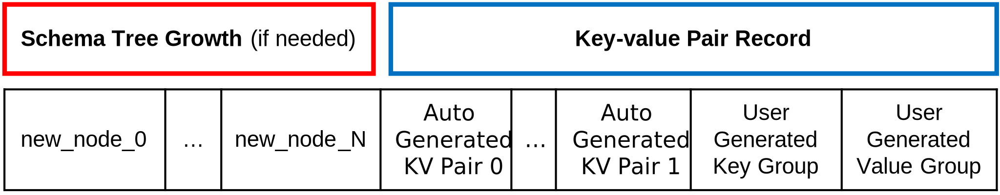
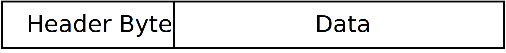
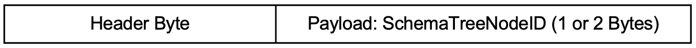
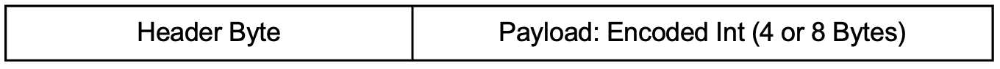
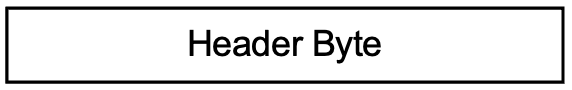
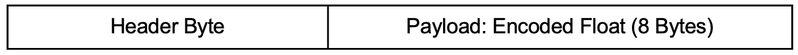
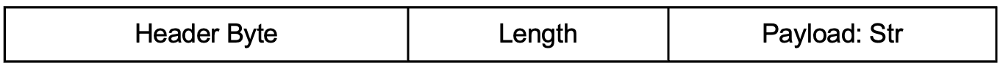
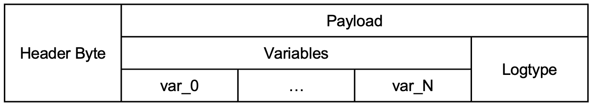

# Key-Value Pair IR Stream

## Introduction

As outlined in [Uber's blog post][uber-blog] from 2022, the CLP IR stream format is a lightweight
serialization format designed for log streaming compression. However, due to its design constraints,
this IR stream format is primarily suited for simple, unstructured logs, such as raw text logs,
which typically consist of only a timestamp field and a log message field. Consequently,
structured logs, such as JSON logs, cannot be efficiently serialized using this format.

Building upon the principles of the existing IR stream format and drawing inspiration from
[clp-s][clp-s-osdi] (which extends CLP to support structured logs), we have developed a new
IR format: the CLP key-value pair IR stream format. This new format enhances the original design by
efficiently supporting key-value pair serialization, thereby addressing the limitations of the
previous IR format.

This new IR format has been successfully deployed in production environments to serialize real-world
log events for cost reduction. These log events originate from diverse sources, including:
- Application and services logs in datacenters.
- User, application, and FSD (full self-driving) operational logs on electrical vehicles on the
  road.

## Design Overview

### Flattened Representation of Hierarchical Schema Structures

The CLP key-value pair IR format supports arbitrary schema structures, similar to JSON and YAML. To
enhance efficiency, it employs a flattened schema representation derived from [clp-s][clp-s-osdi].
Unlike traditional nested storage, it uses a schema tree to model hierarchical relationships between
keys and values. Each schema tree node has a unique ID and a defined type, representing a key or
container. Rather than storing full schema structures, schemas are encoded as sets of leaf node IDs.
The format serializes kv-pairs as schema-tree-node-ID-value tuples, improving storage efficiency.

### Auto-generated kv-pairs vs. User-generated kv-pairs

CLP key-value pair IR format categorizes the kv-pairs of a log event into two categories:
- **Auto-generated kv-pairs**: KV-pairs (e.g., timestamps, log levels, other metadata) that are
  automatically generated by the logging library.
- **User-generated kv-pairs**: Custom kv-pairs (e.g., log messages).

This design prevents conflicts between auto-generated and user-generated keys by keeping them
separate. Each IR stream maintains auto-generated keys and user-generated keys in two independent
schema trees, ensuring clear differentiation and avoiding unintended interference.

#### Example

Consider the following two sets of kv-pairs:

<table style="border-collapse: collapse; width: 100%;">
<tr>
    <th style="border: 1px solid black;">Key-Value Pairs #1</th>  
    <th style="border: 1px solid black;">Key-Value Pairs #2</th>  
</tr>
<tr>
    <td style="border: 1px solid black; vertical-align: top;">
        <pre>
{
  "log_id": 2648,
  "version_num": 1.01,
  "has_error": true,
  "error_type": "usage",
  "msg": "UID=0",
  "data": null,
  "input_array": [10, 20, 30],
  "machine_info": {
    "machine_num": 123
  },
  "additional_info": {}
}
        </pre>
    </td>
    <td style="border: 1px solid black; vertical-align: top;">
        <pre>
{
  "log_id": 2649,
  "version_num": 1.01,
  "has_error": false,
  "error_type": "N/A",
  "msg": "success",
  "data": {},
  "input_array": [10, 20, 30],
  "machine_info": {
    "machine_num": 123
  },
  "additional_info": {
    "result": [11, 21, 31]
  }
}
        </pre>
    </td>
</tr>
</table>

The following is a merged schema tree that can represent both sets of kv-pairs:

:::{mermaid}
%%{init: {'theme':'neutral'}}%%
graph LR;
    0["#0:'Root'(Object)"]
    1["#1:'log_id'(Integer)"]
    2["#2:'version_num'(Float)"]
    3["#3:'has_error'(Boolean)"]
    4["#4:'error_type'(String)"]
    5["#5:'msg'(String)"]
    6["#6:'data'(Object)"]
    7["#7:'input_array'(Unstructured Array)"]
    8["#8:'machine_info'(Object)"]
    9["#9:'machine_num'(Integer)"]
    10["#10:'additional_info'(Object)"]
    11["#11:'msg'(String)"]
    12["#12:'data'(String)"]
    13["#13:'result'(Unstructured Array)"]
    0 --> 1
    0 --> 2
    0 --> 3
    0 --> 4
    0 --> 5
    0 --> 6
    0 --> 7
    0 --> 8
    0 --> 10
    0 --> 11
    0 --> 12
    8 --> 9
    10 --> 13
:::

Using this schema tree, the kv-pairs are encoded as node-ID sets, representing the structure
compactly:

<table style="border-collapse: collapse; text-align: center; width: 50%;">
<tr>
    <th style="border: 1px solid black;">Key-Value Pairs #1</th>  
    <th style="border: 1px solid black;">Key-Value Pairs #2</th>  
</tr>
<tr>
    <td style="border: 1px solid black;">
        <pre>[1, 2, 3, 4, 5, 6, 7, 9, 10]</pre>
    </td>
    <td style="border: 1px solid black;">
        <pre>[1, 2, 3, 4, 7, 9, 11, 12, 13]</pre>
    </td>
</tr>
</table>

## Format Specification

### Overview

The following terms define key concepts in the context of IR streams:

- **Log event**: A collection of auto-generated and user-generated key-value pairs recorded by an
  application.
- **Encoded text AST**: A logtype paired with a list of encoded variables, representing a structured
  abstraction of a text string.
- **IR encoding**: The process of transforming a log event into an IR log event to achieve specific
  goals, such as improving compressibility or preparing data for ingestion into a CLP/CLP-S archive.
  - Example: Parsing a string into an encoded text AST.
- **IR log event**: A log event after IR encoding.
- **IR decoding**: The reverse process of IR encoding, restoring the original log event.
- **Packet**: A byte stream (which may be part of a larger byte stream) that contains a header and
  an optional payload for storing application data.
- **IR stream serialization**: The process of converting a sequence of IR log events into a byte
  stream following the IR stream protocol.
  - Serialization of an IR unit involves the following steps:
    - **Deconstruction (optional)**: Breaking an IR unit into components that can be individually
      serialized.
    - **Encoding (optional)**: Transforming an IR unit to achieve compression or structural
      efficiency.
      - May require maintaining some global states.
    - **Encapsulation**: Packaging serialized components into packets before writing them to a byte
      stream.
- **Deserialization**: The reverse process of serialization, reconstructing the original IR unit.
  - Deserialization includes:
    - **Unwrapping**: Extracting an IR unit component from a packet.
    - **Decoding**: Reversing any encoding performed during serialization.
    - **Reconstruction**: Assembling components to recover the original IR unit.
- **IR stream serializer**: A class to perform serialization.
- **IR stream deserializer**: A class to perform deserialization.
- **An IR unit**: The smallest meaningful unit of an IR byte stream that a user-level program may
  process.
  - An IR unit may or may not include a packet header.
    - Example: An IR unit may be serialized as a sequence of packets, where each packet contains
      part of the IR unit, as defined by the protocol.

### Schema Tree

As mentioned in [Design Overview](#design-overview), schema tree efficiently models hierarchical
relationships between keys and values. Each IR stream maintains two merged schema tree to track all
encountered schemas in auto-generated kv-pairs and user-generated kv-pairs, respectively. The schema
tree has the following assumptions:

As described in the [Design Overview](#design-overview), the schema tree efficiently models
hierarchical relationships between keys and values. Each IR stream maintains two merged schema trees
to track encountered schemas in auto-generated and user-generated key-value pairs, respectively.

The schema tree follows these structural assumptions:
- Logical storage in a vector.
  - Index 0 is reserved for the root node. A root node always exists.
  - Nodes are stored in a vector, with node IDs corresponding to their index.
  - New nodes are appended to the end of the vector.
- Type system: Each schema tree node is typed to optimize value representation and retrieval.
    - **Object**: Represents an arbitrary object.
        - As a non-leaf node, it denotes a hierarchical key-value level.
        - As a leaf node, it may represent `null` or an empty key-value set (e.g., `{}`).
    - **Unstructured Array**: Represents an array stored as a JSON string. (Leaf node only)
    - **String**: Represents a UTF-8 encoded byte sequence. (Leaf node only)
    - **Int**: Represents a 64-bit signed integer. (Leaf node only)
    - **Float**: Represents a double-precision floating-point number. (Leaf node only)
    - **Boolean**: Represents a boolean value. (Leaf node only)
- Key representation: Each schema tree node represents a key, which must be a string.
- Schema tree node locator: Each schema tree node can be uniquely identified by a tuple of:
  - Node type.
  - Parent node ID.
  - Key string.

### Stream-level Metadata

Each IR stream contains a stream-level metadata section at the beginning of the stream. The metadata
is represented by key-value pairs.

The mandatory fields:
- `"VERSION"`: The stream version, represented as a string.
- `"VARIABLES_SCHEMA_ID"`: The variable schema ID, represented as a string.
- `"VARIABLE_ENCODING_METHODS_ID"`: The variable encoding ID, represented as a string.

Optional fields:
- `"USER_DEFINED_METADATA"`: Custom metadata provided by the user, represented as key-value pairs.

### IR Packets

In this section, we will enumerate all valid IR packets and their formats. Each IR packet is
assigned with one or several header bytes that can be uniquely identified. Each header byte will be
given a unique string ID. To find the numerical value of these header bytes, check
[Appendix: IR Packet Header Bytes](#appendix-ir-packet-header-bytes).

Supported Packets:
- [Metadata Packet](#metadata-packet)
- [JSON Metadata Packet](#json-metadata-packet)
- [Integer Value Packet](#integer-value-packet)
- [Float Value Packet](#float-value-packet)
- [True Value Packet](#true-value-packet)
- [False Value Packet](#false-value-packet)
- [String Value Packet](#string-value-packet)
- [Four-byte Encoded Variable Packet](#four-byte-encoded-variable-packet)
- [Eight-byte Encoded Variable Packet](#eight-byte-encoded-variable-packet)
- [Dictionary Variable Packet](#dictionary-variable-packet)
- [LogtypePacket](#logtype-packet)
- [Four-byte Encoded Text AST Packet](#four-byte-encoded-text-ast-packet)
- [Eight-byte Encoded Text AST Packet](#eight-byte-encoded-text-ast-packet)
- [Eight-byte Encoded Text AST Packet](#eight-byte-encoded-text-ast-packet)
- [Null Value Packet](#null-value-packet)
- [Empty Value Packet](#empty-value-packet)
- [Encoded Schema Tree Node ID Packet](#encoded-schema-tree-node-id-packet)
- [Encoded Schema Tree Node Parent ID Packet](#encoded-schema-tree-node-parent-id-packet)
- [Schema Tree Node Locator Packet](#schema-tree-node-locator-packet)
- [End-of-stream Packet](#end-of-stream-packet)

#### Metadata Packet

:::{mermaid}
%%{init: {'theme':'neutral'}}%%
block-beta
    columns 5
    A["Header Byte"]:1
    B["Length"]:2
    B["Payload: Metadata Byte Sequence"]:2
:::

A Metadata Packet consists of a header byte, an encoded length, and the payload bytes:

- Header Bytes: Specifies the length encoding type.
    - `MetadataLengthUByte`: The length is a 1-byte unsigned integer.
    - `MetadataLengthUShort`: The length is a 2-byte unsigned integer.
- Length: The unsigned integer representing the byte sequence's length, encoded in big-endian format
  as specified by the header.
- Payload: The actual metadata byte sequence.

#### JSON Metadata Packet

:::{mermaid}
%%{init: {'theme':'neutral'}}%%
block-beta
    columns 3
    A["Header Byte"]:1
    B["JSON Metadata"]:2
:::

A JSON Metadata Packet consists of a header byte and the JSON metadata.

- Header Byte: Specifies the metadata encoding type, set to `MetadataJsonEncoding`.
- JSON Metadata: The metadata serialized as a JSON string. Must be a
  [Metadata Packet](#metadata-packet).

#### Integer Value Packet

:::{mermaid}
%%{init: {'theme':'neutral'}}%%
block-beta
    columns 3
    A["Header Byte"]:1
    B["Payload: Encoded Integer"]:2
:::

An Integer Value Packet consists of a header byte and an encoded integer payload:

- Header Byte: Specifies the integer encoding type.
  - `IntValue_1byte`: Payload is a signed 1-byte integer.
  - `IntValue_2byte`: Payload is a signed 2-byte integer.
  - `IntValue_4byte`: Payload is a signed 4-byte integer.
  - `IntValue_8byte`: Payload is a signed 8-byte integer.
- Payload: The integer value, encoded in big-endian format as specified by the header.

#### Float Value Packet

:::{mermaid}
%%{init: {'theme':'neutral'}}%%
block-beta
    columns 3
    A["Header Byte"]:1
    B["Payload: Encoded Float"]:2
:::

A Float Value Packet consists of a header byte and an encoded floating-point payload:

- Header Byte: Indicates the floating-point encoding type.
  - `FloatValue_8byte`: The payload is a double-precision (64-bit) floating-point number.
- Payload: The floating-point value, encoded in big-endian format as specified by the header.

#### True Value Packet

:::{mermaid}
%%{init: {'theme':'neutral'}}%%
block-beta
    columns 1
    A["Header Byte"]:1
:::

A True Value Packet only contains a header byte:

- Header Byte: Represents the boolean value `True`, set to `BoolValue_true`.

#### False Value Packet

:::{mermaid}
%%{init: {'theme':'neutral'}}%%
block-beta
    columns 1
    A["Header Byte"]:1
:::

A False Value Packet only contains a header byte:

- Header Byte: Represents the boolean value `False`, set to `BoolValue_false`.

#### String Value Packet

:::{mermaid}
%%{init: {'theme':'neutral'}}%%
block-beta
    columns 5
    A["Header Byte"]:1
    B["Length"]:2
    C["Payload: String"]:2
:::

A String Value Packet consists of a header byte, an encoded length, and the payload bytes:

- Header Bytes: Specifies the length encoding type.
    - `StringLen_1byte`: The length is a 1-byte unsigned integer.
    - `StringLen_2byte`: The length is a 2-byte unsigned integer.
    - `StringLen_4byte`: The length is a 4-byte unsigned integer.
- Length: The unsigned integer representing the string’s length, encoded in big-endian format as
  specified by the header.
- Payload: The actual string, serialized as a sequence of bytes.

#### Four-byte Encoded Variable Packet

:::{mermaid}
%%{init: {'theme':'neutral'}}%%
block-beta
columns 3
    A["Header Byte"]:1
    B["Payload: Encoded Variable"]:2
:::

A Four-byte Encoded Variable Packet consists of a header byte and an encoded payload:

- Header Byte: Specifies the encoding type, set to `VarFourByteEncoding`
- Payload: A four-byte sequence encoded in big-endian format.

#### Eight-byte Encoded Variable Packet

:::{mermaid}
%%{init: {'theme':'neutral'}}%%
block-beta
columns 3
    A["Header Byte"]:1
    B["Payload: Encoded Variable"]:2
:::

An Eight-byte Encoded Variable Packet consists of a header byte and an encoded payload:

- Header Byte: Specifies the encoding type, set to `VarEightByteEncoding`
- Payload: An eight-byte sequence encoded in big-endian format.

#### Dictionary Variable Packet

:::{mermaid}
%%{init: {'theme':'neutral'}}%%
block-beta
    columns 5
    A["Header Byte"]:1
    B["Length"]:2
    C["Payload: String"]:2
:::

A Dictionary Variable Packet consists of a header byte, an encoded length, and the payload bytes:

- Header Bytes: Specifies the length encoding type.
    - `VarStrLenUByte`: The length is a 1-byte unsigned integer.
    - `VarStrLenUShort`: The length is a 2-byte unsigned integer.
    - `VarStrLenInt`: The length is a 4-byte unsigned integer.
- Length: The unsigned integer representing the dictionary variable's length, encoded in big-endian
  format as specified by the header.
- Payload: The actual dictionary variable, serialized as a sequence of bytes.

#### Logtype Packet

:::{mermaid}
%%{init: {'theme':'neutral'}}%%
block-beta
    columns 5
    A["Header Byte"]:1
    B["Length"]:2
    C["Payload: String"]:2
:::

A Logtype Packet consists of a header byte, an encoded length, and the payload bytes:

- Header Bytes: Specifies the length encoding type.
    - `LogtypeStrLenUByte`: The length is a 1-byte unsigned integer.
    - `LogtypeStrLenUShort`: The length is a 2-byte unsigned integer.
    - `LogtypeStrLenInt`: The length is a 4-byte unsigned integer.
- Length: The unsigned integer representing the logtype's length, encoded in big-endian format as
  specified by the header.
- Payload: The actual logtype, serialized as a sequence of bytes.

#### Four-byte Encoded Text AST Packet

:::{mermaid}
%%{init: {'theme':'neutral'}}%%
block-beta
    columns 7
    A["Header Byte"]:1
    B["Variables"]:4
    C["Logtype"]:2
:::

A Four-byte Encoded Text AST Packet consists of a header byte, an array of variable packets, and
a log type packet:

- Header Byte: Specifies the encoding type, set to `StringValue_CLP_4byte`.
- Variables: An array of encoded variables, serialized as variable packets. Each variable packet
  must be one of the following packet type:
  - [Four-byte Encoded Variable Packet](#four-byte-encoded-variable-packet)
  - [Dictionary Variable Packet](#dictionary-variable-packet)
- Logtype: The logtype. Must be a [Logtype Packet](#logtype-packet).

#### Eight-byte Encoded Text AST Packet

:::{mermaid}
%%{init: {'theme':'neutral'}}%%
block-beta
columns 7
    A["Header Byte"]:1
    B["Variables"]:4
    C["Logtype"]:2
:::

An Eight-byte Encoded Text AST Packet consists of a header byte, an array of variable packets, and
a log type packet:

- Header Byte: Specifies the encoding type, set to `StringValue_CLP_8byte`.
- Variable Packets: An array of encoded variables, serialized as variable packets. Each variable
  packet must be one of the following packet type:
    - [Eight-byte Encoded Variable Packet](#eight-byte-encoded-variable-packet)
    - [Dictionary Variable Packet](#dictionary-variable-packet)
- Logtype Packet: The logtype. Must be a [Logtype Packet](#logtype-packet).

#### Null Value Packet

:::{mermaid}
%%{init: {'theme':'neutral'}}%%
block-beta
    columns 1
    A["Header Byte"]:1
:::

A Null Value Packet only contains a header byte:

- Header Byte: Represents the null value `null`, set to `ObjValue_Null`.

#### Empty Value Packet

:::{mermaid}
%%{init: {'theme':'neutral'}}%%
block-beta
    columns 1
    A["Header Byte"]:1
:::

An Empty Value Packet only contains a header byte:

- Header Byte: Represents the empty value `{}`, set to `ObjValue_Empty`.

#### Encoded Schema Tree Node ID Packet

:::{mermaid}
%%{init: {'theme':'neutral'}}%%
block-beta
    columns 3
    A["Header Byte"]:1
    B["Payload: Encoded Schema Tree Node ID"]:2
:::

An Encoded Schema Tree Node ID Packet consists of a header byte and an encoded schema tree node ID
payload:

- Header Byte: Specifies the schema tree node ID encoding type.
    - `KeyID_1byte`: Payload is a 1-byte one's complement integer.
    - `KeyID_2byte`: Payload is a 2-byte one's complement integer.
    - `KeyID_4byte`: Payload is a 4-byte one's complement integer.
- Payload: The schema tree node ID, encoded in big-endian format as specified by the header.
  - If the encoded ID is positive, it represents a node ID from the user-generated schema tree.
  - If the encoded ID is negative, its absolute value represents a node ID from the auto-generated
    schema tree.

#### Encoded Schema Tree Node Parent ID Packet

:::{mermaid}
%%{init: {'theme':'neutral'}}%%
block-beta
    columns 3
    A["Header Byte"]:1
    B["Payload: Encoded Schema Tree Parent Node ID"]:2
:::

An Encoded Schema Tree Node Parent ID Packet consists of a header byte and an encoded schema tree
node parent ID payload:

- Header Byte: Specifies the schema tree node parent ID encoding type.
    - `ParentID_1byte`: Payload is a 1-byte one's complement integer.
    - `ParentID_2byte`: Payload is a 2-byte one's complement integer.
    - `ParentID_4byte`: Payload is a 4-byte one's complement integer.
- Payload: The schema tree node parent ID, encoded in big-endian format as specified by the header.
    - If the encoded ID is positive, it represents a node ID from the user-generated schema tree.
    - If the encoded ID is negative, its absolute value represents a node ID from the auto-generated
      schema tree.

#### Schema Tree Node Locator Packet

:::{mermaid}
%%{init: {'theme':'neutral'}}%%
block-beta
    columns 5
    A["Header Byte"]:1
    B["Schema Tree Node Parent ID"]:2
    C["Key"]:2
:::

- Header Byte: Specifies the schema tree node's type. Must be one of the following:
  - `SchemaTreeNodeInteger`: Integer type.
  - `SchemaTreeNodeFloat`: Float type.
  - `SchemaTreeNodeBoolean`: Boolean type.
  - `SchemaTreeNodeString`: String type.
  - `SchemaTreeNodeUnstructuredArray`: Unstructured-array type.
  - `SchemaTreeNodeObject`: Object type.
- Schema Tree Node Parent ID: The parent node ID in the schema tree, serialized as an
  [Encoded Schema Tree Node Parent ID Packet](#encoded-schema-tree-node-parent-id-packet).
- Key: The key of the node, serialized as a [String Value Packet](#string-value-packet)

#### End-of-stream Packet

:::{mermaid}
%%{init: {'theme':'neutral'}}%%
block-beta
    columns 1
    A["Header Byte"]:1
:::

- Header Byte: Represents the end of an IR stream, set to `EndOfStream`.

### IR Units

In this section, we will enumerate all valid IR unites and their formats. Each unit consists of one
or more packets as defined in [IR Packets](#ir-packets).

Supported Units:
- [Schema Tree Node Insertion Unit](#schema-tree-node-insertion-unit)
- [Log Event Unit](#log-event-unit)
- [End-of-stream Unit](#end-of-stream-unit)

#### Schema Tree Node Insertion Unit

#### Log Event Unit

#### End-of-stream Unit

## Appendix: IR Packet Header Bytes

| **Name**                        | **Byte** |
|---------------------------------| -------- |
| SchemaTreeNodeInteger           | 0x71     |
| SchemaTreeNodeFloat             | 0x72     |
| SchemaTreeNodeBoolean           | 0x73     |
| SchemaTreeNodeString            | 0x74     |
| SchemaTreeNodeUnstructuredArray | 0x75     |
| SchemaTreeNodeObject            | 0x76     |
| ParentID_1byte                  | 0x60     |
| ParentID_2byte                  | 0x61     |
| ParentID_4byte                  | 0x62     |
| KeyID_1byte                     | 0x65     |
| KeyID_2byte                     | 0x66     |
| KeyID_4byte                     | 0x67     |
| StringLen_1byte                 | 0x41     |
| StringLen_2byte                 | 0x42     |
| StringLen_4byte                 | 0x43     |
| IntValue_1byte                  | 0x51     |
| IntValue_2byte                  | 0x52     |
| IntValue_4byte                  | 0x53     |
| IntValue_8byte                  | 0x54     |
| IntValue_8byte_unsigned         | 0x55     |
| FloatValue_8byte                | 0x56     |
| BoolValue_true                  | 0x57     |
| BoolValue_false                 | 0x58     |
| StringValue_CLP_4byte           | 0x59     |
| StringValue_CLP_8byte           | 0x5a     |
| ObjValue_Empty                  | 0x5e     |
| ObjValue_Null                   | 0x5f     |
| VarFourByteEncoding             | 0x18     |
| VarEightByteEncoding            | 0x19     |
| VarStrLenUByte                  | 0x11     |
| VarStrLenUShort                 | 0x12     |
| VarStrLenInt                    | 0x13     |
| LogtypeStrLenUByte              | 0x21     |
| LogtypeStrLenUShort             | 0x22     |
| LogtypeStrLenInt                | 0x23     |
| TimestampVar                    | 0x30     |
| TimestampDeltaByte              | 0x31     |
| TimestampDeltaShort             | 0x32     |
| TimestampDeltaInt               | 0x33     |
| TimestampDeltaLong              | 0x34     |
| MetadataJsonEncoding            | 0x01     |
| MetadataLengthUByte             | 0x11     |
| MetadataLengthUShort            | 0x12     |
| EndOfStream                     | 0x00     |

[uber-blog]: https://www.uber.com/en-US/blog/reducing-logging-cost-by-two-orders-of-magnitude-using-clp/
[clp-s-osdi]: https://www.uber.com/en-US/blog/reducing-logging-cost-by-two-orders-of-magnitude-using-clp/

---

## Key-Value Pair IR Stream and Streamable IR Units
Our goal for Key-Value Pair IR Stream (KV Pair IR) is to break CLP-S into phases like we did for 
CLP so that we can still achieve a substantial amount of initial compression, but leave the heavy 
resource intensive deduplication of variable values for later processing. Like IRv1, KV Pair IR 
enables the lossless compression of logs on an entry by entry basis. KV Pair IR is a superset of 
IRv1, expanding on the IRv1 structure to support more types of variables and logs suited for 
managing semi-structured logs like JSON. Rather than needing the entire log file in order to 
compress, KV Pair IR can be built one log entry at a time. Like CLP-S, KV Pair IR still maintains 
two schema trees (user generated and auto generated), but the schema trees use a simplified set of 
types string, integer, float, boolean, unstructured arrays, and objects. These types can map to 
multiple CLP-S types, but keeping a simplified list of types limits any specialization to the 
archive. 

Using the example log events from above we can build the simplified schema trees used by KV Pair IR
 in Figure 5 & 6. You can see they share many similarities with the CLP-S schema tree in Figure 2, 
 but uses fewer nodes because nodes like "msg" and “data" are now expressed as generic types.

<strong>TODO:: UPDATE WITH AUTO GENERATED NODES</strong>
<strong>Figure 5</strong>: Key-Value Pair IR Stream User Generarted Schema Tree

IMAGE PLACEHOLDER

<strong>TODO:: UPDATE WITH AUTO GENERATED NODES</strong> 
<strong>Figure 6</strong>: Key-Value Pair IR Stream Auto Generarted Schema Tree

Using the combined schema trees, how can we build the schema trees one log event at a time to 
enable a streamable format similar to CLP’s IRv1? We do this by breaking each log event down into 
a series of IR units: schema tree growth IR units describing changes in the schema tree, key IR 
Units, and value IR units. Although we will use the terminology IR unit to describe the individual 
IR stream elements, all of the IR units corresponding to a single log event would be sent in a 
single network packet to preserve the order of the individual elements. Since the indices of the IR
 Units in the stream are used inherently by the future log events. 

Each log event will consist of a set of schema tree growth IR units, one for each new tree node 
added, optionally a set of key value IR unit pairs for the auto generated schema nodes, and then a 
set of key IR units and corresponding value IR units corresponding to each user generated key value
 pair in the log entry (Figure 7). To differnetiate between the auto and user generated node ids we
  use the 1's complement to encode the auto generated node ids. You can see this encoding pattern 
  in Figure 8. Rather than organizing the IR units so that each value comes directly after its key,
   we group the keys and values together. We found that in practice the similarities between keys 
   and between values allows for better compression ratios when stored together. If a log record 
   does not result in any new schema tree nodes, there will be no new schema tree growth IR units 
   for that record. While we stream the IR units we keep the schema tree we’ve built in memory for 
   easy reference, so all packets in the stream can reference the same set of schema tree nodes. 

<strong>Figure 7</strong>: Streaming Structure for Each Log Entry

:::{mermaid}
%%{init: {'theme':'neutral'}}%%
block-beta
columns 6
  A1["Schema Tree"]:2
  B1["Auto Generated Key"]:2
  C1["User Generated Key"]:2
  A2["Encoded ID"]:2
  block:group1:2
    columns 4
    B2_1["..."]
    B2_2["-3"]
    B2_3["-2"]
    B2_4["-1"]
  end
  block:group2:2
    columns 4
    C2_1["0"]
    C2_2["1"]
    C2_3["2"]
    C2_4["..."]
  end
  A3["Actual ID"]:2
  block:group3:2
    columns 4
    B3_1["..."]
    B3_2["2"]
    B3_3["1"]
    B3_4["0"]
  end
  block:group4:2
    columns 4
    C3_1["0"]
    C3_2["1"]
    C3_3["2"]
    C3_4["..."]
  end
:::

<strong>Figure 8</strong>: Node Id Encoding

:::{mermaid}
%%{init: {'theme':'neutral'}}%%
block-beta
  columns 6
    A["Header Byte"]:2
    B["Data"]:4
:::

<strong>Figure 9</strong>: Generic IR Unit

Every IR unit in the stream will consist of two parts (Figure 9). The first being a header byte 
which will specify what kind of IR unit it is. You can see a list of all the possible header bytes 
in the [Appendix](#appendix-ir-packet-header-bytes). The second being the corresponding data. This data format will change
 depending on the header byte and in some cases will be excluded as all necessary information is 
 specified by the header byte alone. Below we will look at the different kinds of IR units and show
  how to represent the two example log events from Figure 1 using a stream of these IR units. 

Figure 10 shows the structure of the schema tree growth IR unit. The header byte is used to both 
label the IR unit as a growth IR unit and to correspond to the type of node being added to the 
schema tree. Then the data portion is further broken into two parts; the parent schema node ID with
 a byte indicating the size of the integer of the ID (1, 2, 4, or 8 bytes) and the actual node ID 
 of the parent, and the key name of the new node which consists of the number of bytes in the 
 length (1, 2, 4, or 8 bytes), the length of the string, and the characters in the key.

:::{mermaid}
%%{init: {'theme':'neutral'}}%%
block-beta
  columns 5
    A["Header Byte\n(Node Type)"]:1
    block:group3:2
        columns 1
        B["Parent ID(Int)"]
        block:group5
            D["Len Header"]
            E["Payload"]
        end
    end
    block:group4:2
        columns 1
        C["Key Name (String)"]
        block:group6
            F["Len Header"]
            G["Length"]
            H["Payload"]
        end
    end
:::

<strong>Figure 10</strong>: Schema Tree Growth IR Unit

After all the schema tree growth IR units generated by a log event are added to the Key-Value Pair 
IR Stream, then comes all the keys followed by all the values. Figure 11 shows the structure of a 
key IR unit. The header byte identifies it as a key IR unit and indicates the number of bytes of 
the data. Then the data portion consists of the ID of the schema tree node corresponding to the key
 and type of the value that will follow.

:::{mermaid}
%%{init: {'theme':'neutral'}}%%
block-beta
  columns 6
    A["Header Byte"]:2
    B["Payload: Schema Tree Node ID (1 or 2 Bytes)"]:4
:::

<strong>Figure 11</strong>: Key IR Unit

After all the necessary key IR units are streamed the value IR units corresponding to these keys 
follow. There are always the same number of values as there are keys and the values are streamed 
in the same order as the keys. You can see all the types of value IR units in Figure 12.  All value
 IR units contain a header byte that corresponds to their type. In the case of Boolean True, 
 Boolean False, Empty, and Null IR units, we only need the header byte since there is no additional
  information needed. For the remaining IR units the data section varies on the type. For both 
  Integer and Float IR units, the data section is used directly for the encoded numeric value. 
  String IR units are broken into two categories; with and without spaces. If the string does not 
  contain spaces, then the data is split into two parts; the length of the string and the 
  characters of the string. Strings containing spaces are further broken down and encoded using the
   same methodology as CLP. Unstructured arrays are encoded in the same manner as strings with 
   spaces. 

:::{mermaid}
%%{init: {'theme':'neutral'}}%%
block-beta
  columns 6
    A["Header Byte"]:2
    B["Payload: Encoded Int (4 or 8 Bytes)"]:4
:::

<strong>A</strong>: Integer

:::{mermaid}
%%{init: {'theme':'neutral'}}%%
block-beta
  columns 6
    A["Header Byte"]:6
:::

<strong>B</strong>: Boolean, Empty Object, NULL

:::{mermaid}
%%{init: {'theme':'neutral'}}%%
block-beta
  columns 6
    A["Header Byte"]:2
    B["Payload: Encoded Float (8 Bytes)"]:4
:::

<strong>C</strong>: Float - see uber blog for details of float 
encoding

:::{mermaid}
%%{init: {'theme':'neutral'}}%%
block-beta
  columns 6
    A["Header Byte"]:2
    B["Length"]:2
    c["Payload: Str"]:2
:::

<strong>D</strong>: Strings 2-ways (Above) No Spaces (Below) With 
Spaces

<strong>NOTE</strong>: Unstructured arrays use the same IR unit as 
strings with spaces. Also object nodes containing values aren't streamed, because you only stream 
elements with direct value.

<strong>Figure 12A-D</strong>: Value IR Units

## Putting It Together

Now that we’ve seen all the IR unit types we can look at what the Key-Value Pair IR Stream would 
look like for the two example log events in Figure 1. The stream would start with the schema tree 
growth IR units for Log Event #1. This would consist of growth IR units for all user generated tree
 nodes with IDs 0 - 10 and the auto generated schema node for the timestamp(Figure 12A). After this
  would come the auto genererated key value pair(s) (Figure 12B). Next would come Log Event #1’s 
  user generated keys IR unit group. It will contain a IR unit for each of the user generated 
  schema tree nodes which have values and together with the auto generated keys would make the log 
  events schema (Figure 12C). Completing the IR units corresponding the log event #1 will be the 
  user generated values IR unit group that corresponds to the keys (Figure 12D). This same pattern 
  continues for Log Event #2 completing the serialization of the log events in the KV Pair IR format 
  (Figure 12E-H).

IMAGE PLACEHOLDER

<strong>A</strong>: Log Event #1 Schema Tree Growth Packets (PID 
represents Parent ID)

IMAGE PLACEHOLDER

<strong>B</strong>:  Log Event #1 Auto Generated Key Value IR Unit 
Pair Group

IMAGE PLACEHOLDER

<strong>C</strong>:   Log Event #1 User Generated Key IR Unit Group

IMAGE PLACEHOLDER

<strong>D</strong>:   Log Event #1 User Generated Value IR Unit Group

IMAGE PLACEHOLDER

<strong>E</strong>: Log Event #2 Schema Tree Growth Packets (PID 
represents Parent ID)

IMAGE PLACEHOLDER

<strong>F</strong>:  Log Event #2 Auto Generated Key Value IR Unit 
Pair Group

IMAGE PLACEHOLDER

<strong>G</strong>:   Log Event #2 User Generated Key IR Unit Group

IMAGE PLACEHOLDER

<strong>H</strong>:   Log Event #2 User Generated Value IR Unit Group

<strong>Figure 12 A-H</strong>: Key-Value Pair IR serialized packet 
stream for example log events in Figure 1

When processing the Key-Value Pair IR Stream into the final CLP-S archive. We can deserialize the 
packet, building the clp-s schema tree based on the schema tree growth packets and use the pre-
parsed key value pairs to build the necessary dictionaries and tables achieving that additional 
compression and deduplication. 

## Check It Out

TODO!!
- Pointers to how to use, etc.

## Background in IRv1

Before we can discuss the Key-Value Pair IR streaming format, let’s talk about IRv1. CLP (Compressed Log 
Processor) is a log compression solution that achieves a higher level of compression than general 
purpose compressors, while maintaining the ability to search the logs without full decompression. 
It manages this by leveraging the unique repetitive characteristics of logs. CLP was originally 
designed for use with unstructured logs. Logs are broken into static text, which remains unchanged 
in different log instances and variables that fill in the blanks in the static text. The building 
of CLPs archives can be broken into two phases. 

Phase 1, is where the logs are parsed and the variables are encoded. This produces an intermediary 
representation (IRv1) which is built one log entry at a time, perfect for processing and partially 
compressing a stream of log entries as they are produced with minimal buffering. 

Phase 2, which can be done offline when resources are available, further deduplicates the logs by 
introducing dictionaries for the static text (i.e. schema) and the variable values. This allows log
 entries to be represented in a table, with each entry consisting a dictionary index of the schema 
 (or static text), a series of dictionary indices representing the values, and an encoded 
 timestamp. Then these tables  can be further compressed using a general compressor like Zstandard 
 in a columnar manner. 

You can read this log post for more details of how CLP's two phase compression works; 
[post](https://www.uber.com/en-CA/blog/reducing-logging-cost-by-two-orders-of-magnitude-using-clp/)
. 
