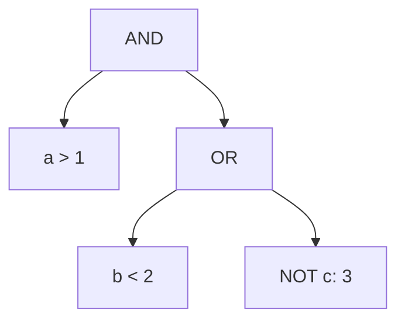
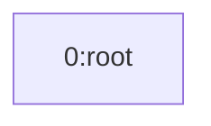
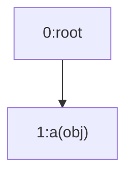
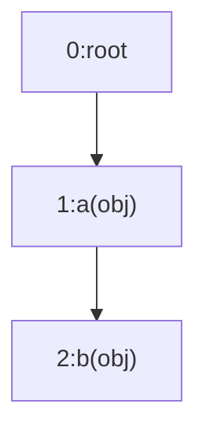
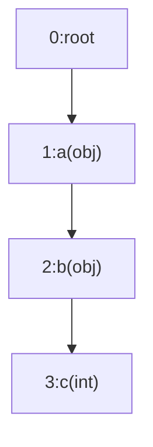
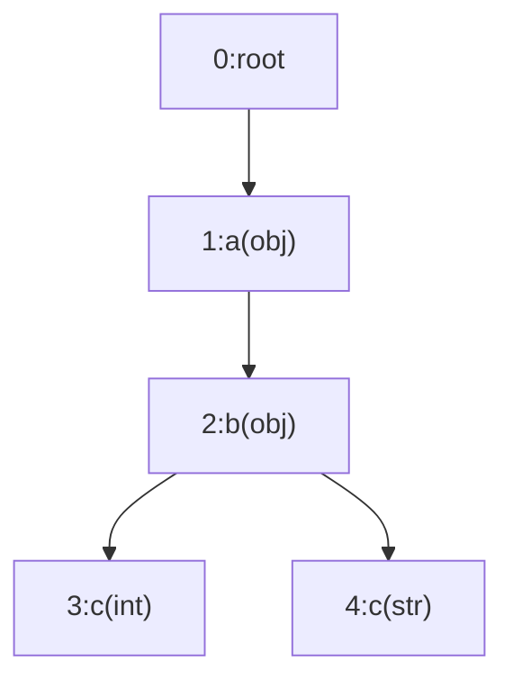
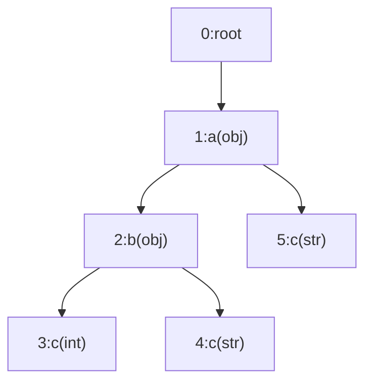

# Search KV-IR streams

In this section, we will talk about the algorithm and design for searching KV-IR streams.

## Background

To understand KV-IR search, it is important to first review how clp-s handles search queries.

### The form of clp-s search queries

clp-s allows users to search compressed archives using KQL (TODO: reference) queries, which consist
of one or more key-value pair filters combined with logical operators. The KQL query can be
represented as a tree of expressions. There are three types of expressions supported in a query AST:

* **AND**: This means all sub-expressions must be satisfied.
* **OR**: This means at least one sub-expression must be satisfied.
* **Filters**: These are the leaves of the AST, representing key-value pairs with an associated
  operator.
  * The key is a root-to-leaf path to the target value,
  * The value is the value to match, and
  * The operator can be an exact match or a numeric comparator.
  
  Both keys and values support the use of `*` wildcards for partial matches.

Note that all types of expressions are invertible, meaning that they can be applied with `NOT`.

For example, a query `a > 1 AND (b < 2 or NOT c.d: 3)` can be represented as the following AST:



Here's an example dynamically structured log event (in JSON form) that matches this query:

```json
{
  "a": 2,
  "b": 1,
  "c": {
    "d": 4
  },
  "e": "whatever"
}
```

### Searching clp-s archives

As described in the clp-s background (TODO: reference), log event schemas are represented using a
merged schema tree, allowing a flattened view of the tree structure in the ERT (TODO: reference).
Thus, the queried key effectively corresponds to a column in the ERT, which we refer to as the
queried column.

Internally, clp-s first parses the KQL query into an abstract syntax tree (AST), then
performs several optimizations to identify matchable schemas (TODO: We should either add a little
more information to explain this, or we defer this to clp-s' doc, or just link to the paper...).
Finally, clp-s decompresses the relevant ERTs (TODO: reference) and searches through each record by
evaluating it against the AST.

## Searching KV-IR streams vs. clp-s archives

KV-IR stream format is very similar to clp-s. It maintains stream-level schema-trees to allow each
dynamically structured key-value pair log events to be represented as a flattened
schema-tree-node-ID-value pairs. Similarly, KV-IR stream search uses the same search syntax to
accept user queries, but comparing to clp-s archive search, it has the following fundamental
limitations:

* **Queries must be dynamically resolved to specific schemas during the deserialization**: The
  merged schema-tree is not available at the start of the search; instead, the schema-tree is built
  dynamically as the stream is read. As a result, queried keys---especially those with wildcards---
  can only be resolved to specific schema nodes during stream deserialization.
* **Every log event in the stream must be evaluated**: The IR stream serializes log events
  sequentially without grouping by schema, so all log events must be first sequentially deserialized
  and then evaluated against the search AST individually.

## KV-IR stream search procedure

From a high-level, searching a KV-IR stream includes the following steps:

1. [Query AST optimization](#query-ast-optimization)
2. [Resolve queried columns to schema-tree nodes](#resolve-queried-columns-to-schema-tree-nodes)
3. [Evaluate the query against each deserialized log event](#evaluate-the-query-against-each-deserialized-log-event)

### Query AST optimization

The first step is to optimize the query AST. We call these optimization "transformation passes"
since they essentially transform the query AST into a more efficient form. The transformation passes
are the same ones used in clp-s, but not all of them are applicable. As explained in previous, the
schema-tree information is not available at the start of the search. Therefore, we can only perform
schemaless optimizations: any transformation passes that require schema information won't be
applied.

Currently, only three transformation passes are applied to the query AST (TODO: Ideally, we should
have a doc to each available transformation pass in clp-s, and we can directly reference them here):

* **Converting to or-of-and form**:
  This transformation rewrites the query AST so that all logical operators are expressed as an `OR`
  of `AND` clauses, using De Morgan's laws. This structure has been shown to be more efficient for
  query evaluation.
* **Narrowing filter types**: This transformation refines each filter's set of matchable types by
  removing any types that cannot possibly match. For example, a filter like `a: *string*` will never
  match an integer, float, or boolean, so those types are excluded. As described in the next stage,
  this ensures that filters are only resolved to schema-tree nodes with compatible types.
* **Converting to exists**: This transformation rewrites filters as `EXISTS` or `NEXISTS` operators
  whenever possible. This allows the evaluation stage to simply check for the presence or absence of
  a value, avoiding unnecessary value comparisons.

### Resolve queried columns to schema-tree nodes

To evaluate filters, it is necessary to identify which schema-tree nodes correspond to each filter's
queried columns. In clp-s, this resolution occurs early in the search process: the merged
schema-tree is traversed to find all nodes that can match a queried column before decompressing any
ERTs. Only ERTs whose schema includes at least one of these matchable nodes will be decompressed for
further evaluation, and thus we can avoid walking through irrelevant ERTs.

Unfortunately, this approach is not applicable to KV-IR streams. In KV-IR streams, the schema-tree
is built dynamically as the stream is read. Therefore, we cannot pre-compute all the matchable
nodes in advance. Instead, we identify these matchable nodes incrementally as the schema-tree grows,
in a top-down manner. We call this process "queried column resolution". We will use the following
example to illustrate this incremental resolution process.

#### Example (TODO: Maybe some other attractive title)

Consider a filter `a.*.c: TestString`, which searches for a value `TestString` at any path matching
the wildcard root-to-leaf path `a.*.c`.

Suppose the schema-tree is constructed step-by-step as follows:

##### Initial schema-tree



The tree starts with only the root node.

##### Insertion of node #1



After inserting **node #1**, we see a key `a` matching the first token in `a.*.c`, so potential
matches for `.*.c` may exist among its descendants.

##### Insertion of node #2



**Node #2** (`b`) is a child of `a` and matches the `*` wildcard. Potential matches for `.c` may be
found among its children.

##### Insertion of node #3



**Node #3** completes the path `a.b.c`, matching `a.*.c`. However, since it is of type `int`, it
cannot match the string value required by the filter, so no resolution occurs yet.

##### Insertion of node #4



**Node #4** (`c` of type `str`) under `b` completes the path `a.b.c` and matches both the key path
and the required type. **Node #4** is now a resolved candidate for the filter.

##### Insertion of node #5



**Node #5** (`c` of type `str`) is a direct child of `a`, matching the path `a.c` (which also fits
`a.*.c`). **Node #5** is added as another resolved candidate.

---

As shown, the filter has no candidate node IDs until **node #4** is inserted, and may have multiple
candidates as the tree grows. Resolution is evaluated dynamically and in a top-down manner,
reflecting the schema-tree's construction.

#### A formal approach

At the code level, the goal is to construct a mapping from each queried column to one or more
schema-tree nodes, subject to:

* The path from the root to the mapped node must match the queried column's full key path.
* The schema-tree node's type must be one of the queried column's matchable types.

To achieve this, two categories of nodes are tracked as the schema-tree is built:

* **Partially resolved nodes**: Nodes whose paths match the initial segments of a queried column but
  are not fully resolved. These nodes are used for further matching as their child nodes are
  inserted.
* **Resolved nodes**: Nodes where the full key path and type match the queried column. These nodes
  are used to evaluate filters against log events.

Let's walk through the example filter `a.*.c: TestString` (tokenized as `[a, *, c]`) again:

The process begins with an initial state: a partially-resolved-node-ID-key pair `(0, a)`, indicating
that the next node to resolve is a child of the root node (#0) with the key `a`. The initial set of
partially-resolved-node-ID-key pairs is `{(0, a)}`.

```
{(0,a)}
```

On [insertion of node #1](#insertion-of-node-1), it matches the root pair `(0, a)`. This resolves
the first token. As a result, two new pairs are added:

* `(1, *)`, indicating the next token is a wildcard and any child of node #1 can be a candidate for
  the next step, and,
* `(1, c)`, since the wildcard `*` can also match zero keys, allowing a direct match to `c` under
  node #1.

The set of partially-resolved-node-ID-key pairs is now:

```
{(0, a), (1, *), (1, c)}.
```

Next, [node #2 is inserted](#insertion-of-node-2) as a child of node #1 with key `b`. We check on
the existing partially-resolved-node-ID-key pairs:

* For `(1,*)`, the wildcard token `*` can match any key, it can be resolved by node #2's key `b`,
  and thus leads to the next token on node #2 with a new partially-resolved-node-ID-key pair
  `(2,c)`.
* For `(1,c)`, the expected key `c` doesn't match node #2's key `b`.

At the end of this step, the set of partially-resolved-node-ID-key pairs is:

```
{(0,a), (1,c), (1,*), (2,c)}
```

When [node #3 is inserted](#insertion-of-node-3) as a child of node #2 with key `c` and type `int`,
the pair `(2, c)` matches key `c`, so the full key path is resolved. However, node #3's type is
`int`, which does not match the filter's required type `str`, so no mapping is updated.

Then, [node #4 is then inserted](#insertion-of-node-4) as another child of node #2 with key `c` and
type `str`. The pair `(2, c)` matches key `c`, and the type matches the filter. Node #4 is therefore
added as a resolved candidate for the filter, resulting in the mapping `<a.*.c: TestString> -> {4}`.

When [node #5 is inserted](#insertion-of-node-5) as a child of node #1, we check the following:

* For `(1,*)`, although the wildcard can match any key, the node #5 is of type `str`, which means it
  cannot have child nodes to resolve the subsequent token `c` after the wildcard.
  Therefore, the partially-resolved set will not be updated in this case.
* For `(1,c)`, the expected key is matched by `c`, the queried column is fully resolved by the
  root-to-node path `a.c`. The type of node #5 is string, which matches the filter's type.
  Therefore, we update the mapping for the filter `a.*.c: Testing` to include node #5, resulting in
  `<a.*.c: Testing> -> {4, 5}`.

In the end, we have the following set of partially-resolved-node-ID-key pairs:

```
{(0,a), (1,c), (1,*), (2,c)}
```

We also construct the following mapping that indicates the target filter can be resolved by nodes #4
and #5:

```
{<a.*.c: Testing> -> {4, 5}}
```

---

It is important to note that these partial resolutions are maintained throughout the entire
streaming process, as additional child nodes may be inserted under nodes #0, #1, or #2, potentially
leading to further resolutions in the future.

In the code level, maintaining this mapping is more complex because:

* Separate mappings must be kept for auto-generated and user-generated key namespaces (TODO: add a
  reference).
* Since the query AST can contain multiple filters, each partially resolved token in the mapping
  should also indicate which filter it is associated with.
* The mapping logic must also handle the case where queried columns begins or ends with wildcards.

Despite these implementation details, the overall algorithm and resolution procedure is the same as
described above.

### Evaluate the query against each deserialized log event

For every deserialized log event, we evaluate the query against it in its node-ID-value pairs form.
The evaluation procedure will walk through the query AST using a depth-first search (DFS) to
evaluate the expressions in a bottom-up manner.

Among all types of expressions, `AND` and `OR` expressions are not directly evaluated, but rather
their child expressions are evaluated first. Early exist may be involved: if a child expression
doesn't satisfy an `AND` expression, the `AND` will return without further evaluating the other
children. Similarly, if a child expression satisfies an `OR` expression, the `OR` can return
immediately.

Filters, as the leaves of the AST, must be directly evaluated on the log event's node-ID-value pairs.
This evaluation is performed by checking if the values in the node-ID-value pairs satisfy the
filter's target value and operator, using the constructed filter-to-node-ID mapping from the
previous stage to determine which values to check.

During the evaluation, each expression in the query AST may be evaluated as one of the following:

* **true**: This means the sub-expression is satisfied the query logic.
* **false**: This means the sub-expression is not satisfied by the query logic.
* **pruned**: This means the sub-expression doesn't have the node-ID-value pairs available to
  evaluate the query. Normally, this means one or more filters' queried columns are not resolved to
  any of the node-IDs in the log event.

On the root, we only consider `true` to be a match of a query. Both `false` and `pruned` are
considered matching failures. The difference is that `false` is logically invertible but `pruned` is
not. For example:

* If `a: 1` evaluates to `false`, then `NOT a: 1` evaluates to `true` since it is invertible.
* If `a: 1` evaluates to `pruned`, then `NOT a: 1` should also be to `pruned` as it's not 
  invertible.
