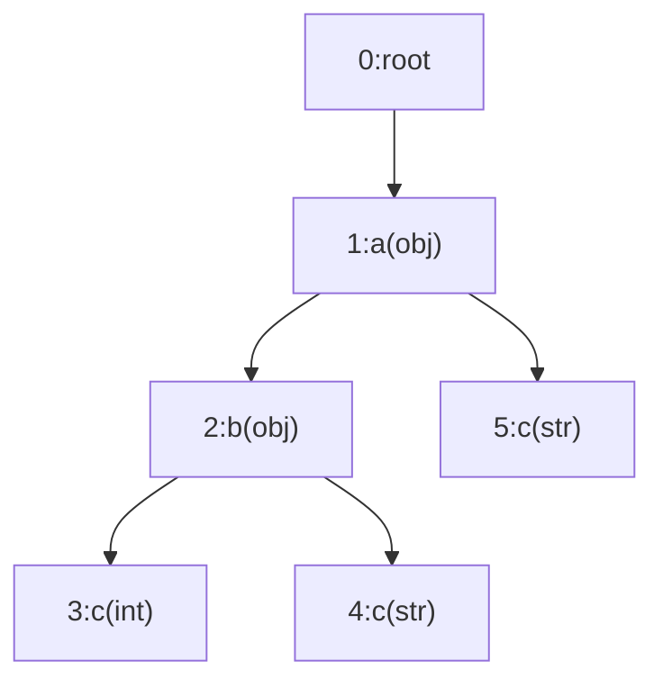

# Search KV-IR streams

In this section, we will talk about the algorithm and design for searching KV-IR stream.

## Background

To understand KV-IR search, it is important to first review how clp-s handles search queries.
clp-s allows users to search compressed archives using KQL (TODO: reference) queries, which consist
of one or more filters combined with logical operators. Each filter represents a key-value pair with
an associated operator, where:
- the key is a hierarchical path to the target value,
- the value is the value to match, and
- the operator can be an exact match or a numeric comparator. 

As described in the clp-s background (TODO: reference), log event schemas are represented using a
merged schema tree, allowing a flattened view of the tree structure in the ERT (TODO: reference).
Thus, the queried key effectively corresponds to a column in the ERT, which we refer to as the
queried column.

Both keys and values support the use of `*` wildcards for partial matches. Internally,
clp-s first parses the KQL query into an abstract syntax tree (AST), then
performs several optimizations to identify matchable schemas and dictionary values. Finally, clp-s
decompresses the relevant ERTs (TODO: reference) and searches through each record by evaluating it
against the AST.

## KV-IR stream search procedure

KV-IR stream format is very similar to clp-s. It maintains stream-level schema-trees to allow each
dynamically structured key-value pair log events to be represented as a flattened
schema-tree-node-ID-value pairs. Similarly, KV-IR stream search uses the same search syntax to
accept user queries, but comparing to clp-s archive search, it has the following fundamental
differences:
- The merged schema-tree is not available at the start of the search; instead, the schema-tree is
  built dynamically as the stream is read. As a result, queried keys—especially those with
  wildcards—can only be resolved to specific schema nodes during stream deserialization.
- The IR stream serializes log events sequentially without grouping by schema, so each log event
  must be first sequentially deserialized and then evaluated against the search AST individually.

From a high-level, searching a KV-IR stream includes the following steps:

1. Query AST optimization.
2. Resolve queried columns to schema-tree nodes.
3. Evaluate the query against each deserialized log event.

### Query AST optimization

The first step is to optimize the query AST. We call these optimization "transformation passes"
since they essentially transform the query AST into a more efficient form. The transformation passes
are the same ones used in clp-s, but not all of them are applicable. As explained in previous, the
schema-tree information is not available at the start of the search. Therefore, we can only perform
schemaless optimizations: any transformation passes that require schema information won't be
applied.

Currently, only three transformation passes are applied to the query AST:
TODO: briefly explain what these three passes do.

### Resolve queried columns to schema-tree nodes

To evaluate filters, we must determine which schema-tree nodes correspond to each queried column.
This requires constructing a mapping from each queried column to one or more schema-tree nodes,
subject to the following:  
- The path from the root to the mapped node must match the queried column's full key path.
- The schema-tree node's type must be one of the queried column's matchable types.

Unlike clp-s, where the schema is known at the start of the search, the schema-tree in KV-IR streams
is built dynamically as the stream is deserialized. As a result, the mapping from queried columns to
schema-tree nodes must also be constructed incrementally. This mapping is built in a top-down
fashion, mirroring the construction of the schema-tree itself. There are two types of nodes to track
when building this mapping:

- **Partially resolved nodes**: Nodes whose paths match the initial segments of a queried column but
  are not fully resolved. These nodes are used for further matching as their child nodes are
  inserted.
- **Resolved nodes**: Nodes where the full key path and type match the queried column. These nodes
  are used to evaluate filters against log events.

To illustrate incremental mapping, consider a query filter `a.*.c: TestString` and the following
schema-tree (nodes are added in order of their IDs):



This queried column `a.*.c` can be tokenized as `[a, *, c]`. The objective is to resolve each token
in sequence until the final token `c` is matched.

Since the token begins with `a` and it is not a wildcard, we start with an initial state of a
partially-resolved-node-ID-key pair `(0,a)`, indicating that the next node to resolve is a child of
the root node (#0) with the key `a`. The initial set of partially-resolved-node-ID-key pairs is:
```
{(0,a)}
```

**On node #1's insertion**, it triggers a match on `(0,a)` since it's a child node of node #0. Since
its key is `a`, we can resolve the first token. This leads to a new partially-resolved-node-ID-key
pair, `(1,*)`, indicating that the next token to resolve is a child of node #1 with any key.
Similarly, `(1,c)` is also added to the set, since the wildcard token `*` can match no keys. At
the end of this step, the set of partially-resolved-node-ID-key pairs is:
```
{(0,a), (1,c), (1,*)}
```

**On node #2's insertion**, it triggers two potential matches on its parent node #1: `(1,*)` and
`(1,c)`:
- For `(1,*)`, the wildcard token `*` can match any key, it can be resolved by node #2's key `b`,
  and thus leads to the next token on node #2 with a new partially-resolved-node-ID-key pair
  `(2,c)`.
- For `(1,c)`, the expected key `c` doesn't match node #2's key `b`.
At the end of this step, the set of partially-resolved-node-ID-key pairs is:
```
{(0,a), (1,c), (1,*), (2,c)}
```

**On node #3's insertion**, it triggers a match on `(2,c)` since it's a child node of node #2.
Despite the fact that node #3's key matches the next token `c`, the filter, `a.*.c: TestString`, can
only match string values. As an integer type node, #3 is not qualified, and thus there are no
updates on the resolutions.

**On node #4's insertion**, it follows the same matching logic as node #3, but this time the type of
node #4 does match the filter's type. Since all the tokens are resolved, we can consider node #4 as
a matchable node for the filter `a.*.c: TestString`, corresponding to the root-to-node path `a.b.c`.
We can construct a mapping for this filter as: `<a.*.c: TestString> -> {4}`.

**On node #5's insertion**, it triggers two matches on its parent node #1: `(1,*)` and `(1,c)`:
- For `(1,*)`, although the wildcard can match any key, the node #5 is of type `str`, which means it
  cannot have child nodes to resolve the subsequent token `c` after the wildcard.
  Therefore, the partially-resolved set will not be updated in this case.
- For `(1,c)`, the expected key is matched by `c`, the queried column is fully resolved by the
  root-to-node path `a.c`. The type of node #5 is string, which matches the filter's type.
  Therefore, we update the mapping for the filter `a.*.c: Testing` to include node #5, resulting in
  `<a.*.c: Testing> -> {4, 5}`.

In the end, we have the following set of partially-resolved-node-ID-key pairs:
```
{(0,a), (1,c), (1,*), (2,c)}
```
We also construct the following mapping that indicates the target filter can be resolved by nodes
#4 and #5:
```
{<a.*.c: Testing> -> {4, 5}}
```

It is important to note that these partial resolutions are maintained throughout the entire
streaming process, as additional child nodes may be inserted under nodes #0, #1, or #2, potentially
leading to further resolutions in the future.

In the code level, maintaining this mapping is more complex because:
- Separate mappings must be kept for auto-generated and user-generated key namespaces.
- Since the query AST can contain multiple filters, each token in the mapping should also indicate
  which filter it is associated with.
- The mapping logic must also account for queried columns that begin or end with wildcards.

### Evaluate the query against each deserialized log event

For every deserialized log event, we evaluate the query against it in its node-ID-value pairs form.
The evaluation procedure will walk through the query AST using a depth-first search (DFS) to
evaluate the sub-expressions. There are three types of sub-expressions in the query AST:
- **AND**: This means all sub-expressions must be satisfied.
- **OR**: This means at least one sub-expression must be satisfied.
- **Filters**: As described above, filters are key-value pairs with an associated operator. The
  evaluation of a filter is performed by checking if the values in the node-ID-value pairs satisfy
  the filter's target value and operator, by using the constructed filter-to-node-ID mapping to
  determines which values to check.

Note that all types of sub-expressions are invertible, meaning that they can be applied with `NOT`.

During the evaluation, each sub-expression in the query AST may be evaluated as one of the
following:
- **true**: This means the sub-expression is satisfied the query logic.
- **false**: This means the sub-expression is not satisfied by the query logic.
- **pruned**: This means the sub-expression doesn't have the node-ID-value pairs available to
  evaluate the query. Normally, this means one or more filters' queried columns are not resolved to
  any of the node-IDs in the log event.

At the top level, we only consider `true` to be a match of a query. Both `false` and `pruned` are
considered matching failures. The difference is that `false` is logically invertible but `pruned` is
not. For example:
- If `a: 1` evaluates to `false`, then `NOT a: 1` evaluates to `true` since it is invertible.
- If `a: 1` evaluates to `pruned`, then `NOT a: 1` should also be to `pruned` as it's not 
  invertible.
