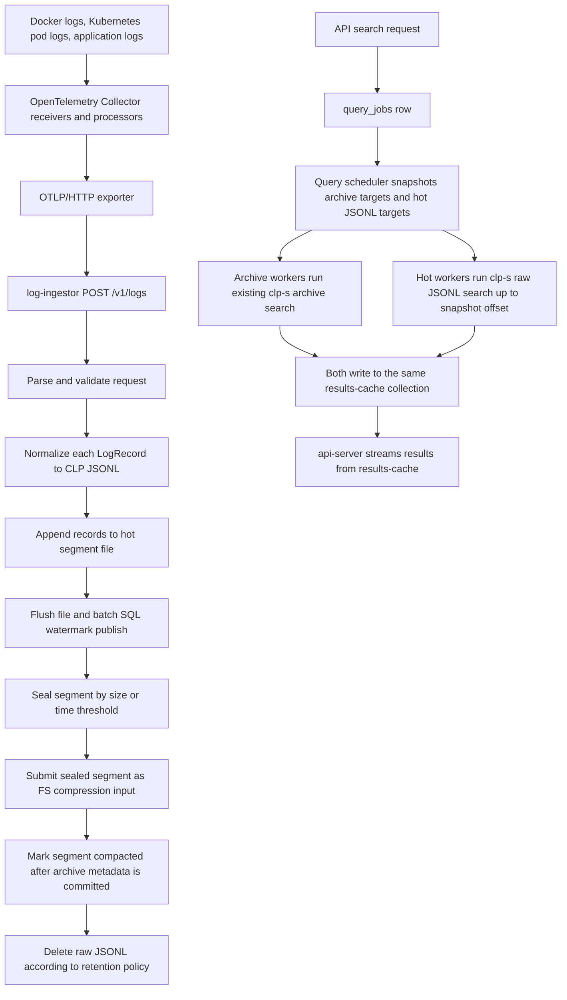

# Real-time Logs Implementation Plan

## Overview

Use `log-ingestor` as CLP's real-time log ingestion service. It receives log payloads over HTTP, writes durable hot JSONL segments, exposes those segments to query workers for immediate search, and submits sealed segments for CLP-S compression.

Use OpenTelemetry Collector as an upstream collection agent, not as CLP's hot-file writer. The collector is responsible for scanning Docker Compose and Kubernetes logs, enriching/normalizing them through standard collector receivers/processors, and forwarding them to `log-ingestor` over OTLP/HTTP.

The core decisions are:

- `log-ingestor` is the CLP write endpoint for user logs.
- OpenTelemetry Collector tails Docker/Kubernetes logs and forwards to `log-ingestor`.
- `log-ingestor` accepts OTLP/HTTP logs at `/v1/logs`, for OpenTelemetry Collector and OTel SDKs.
- Hot storage is plain normalized JSONL, not active `.clp.zst` KV-IR.
- Query scheduler and workers treat hot JSONL segments as first-class search targets beside CLP-S archives.
- Sealed hot segments are compacted into normal CLP-S archives and raw JSONL is deleted only after archive metadata is committed.

This keeps mature Docker/Kubernetes log collection in OpenTelemetry while keeping CLP-specific durability, hot search, and archive handoff in CLP.

## Use cases

- **OpenTelemetry application logs**: applications use OpenTelemetry SDKs or agents and export OTLP logs to `log-ingestor`.
- **Docker Compose dogfood**: an OTel Collector service tails CLP container logs and forwards OTLP logs to `http://log-ingestor:3002/v1/logs`.
- **Kubernetes dogfood**: an OTel Collector DaemonSet tails pod logs and forwards OTLP logs to the CLP `log-ingestor` service.
- **Immediate search**: a query for recent data includes open and sealed hot JSONL segments, not only archives.
- **Archive handoff**: once a segment is sealed and compressed, later queries find those records through the CLP-S archive and no longer scan the raw JSONL segment.
- **Archive-only repeatability**: callers can opt out of hot segments when they need repeatable queries over compacted archives only.

## Requirements

Functional requirements:

- Support CLP-S structured logs first. CLP text archives are out of scope for v1.
- Add `log-ingestor` route `POST /v1/logs`:
  - accept OTLP/HTTP protobuf;
  - accept OTLP/HTTP JSON if practical with the selected protobuf stack;
  - map each `LogRecord` into one normalized JSON object;
  - return success only after the normalized records are committed to hot storage.
- Avoid requiring CLP users to write a custom logging library:
  - document OTel Collector `filelog` plus `otlphttp` exporter for Docker/Kubernetes;
  - document OTel SDK export directly to `log-ingestor`.
- Normalize records before writing hot storage:
  - OTLP input becomes a stable JSON shape containing body, severity, trace/span IDs, attributes, resource attributes, scope attributes, event timestamp, observed timestamp, ingestion timestamp, and `_clp`.
- Resolve dataset:
  - `log-ingestor` reads a fixed OTLP log/resource attribute named `clp.dataset`;
  - if `clp.dataset` is absent, `log-ingestor` uses the hardcoded dataset `default`;
  - bundled CLP package service logs should be tagged by the OTel Collector with `clp.dataset=clp_package`;
  - dataset names must pass existing CLP dataset validation.
- Resolve timestamps:
  - OTLP uses `time_unix_nano`, then observed timestamp, then ingestion time;
  - store normalized millisecond timestamps for query ordering and time filtering.
- Store hot segment metadata in SQL. Do not create one DB row per log record, and do not require one SQL write per received request.
- Batch SQL watermark updates per open segment. `committed_end_offset`, `size_bytes`, `record_count`, and timestamp ranges should be published on a configurable interval/byte threshold, on seal, and during shutdown/recovery.
- Support immediate search over:
  - open segments up to their last committed byte offset;
  - sealed segments waiting for compression;
  - segments currently being compressed but not yet covered by archive metadata.
- Exclude compacted segments after archive metadata is visible.
- Add a query option such as `search_sources` or `include_hot_segments`:
  - default interactive searches include hot segments;
  - archive-only search remains available.
- Hot search results must write the same Mongo results-cache schema as archive search results so `api-server` and WebUI streaming can remain mostly unchanged.
- Compaction thresholds must use separate realtime config keys, not reuse the S3 ingestion buffer config.
- Compaction trigger:
  - an open hot segment is sealed when `seal_threshold_bytes` is reached or `seal_timeout_sec` elapses;
  - clean shutdown and restart recovery may also seal stale open segments;
  - sealed segments are submitted for CLP-S compression immediately, subject to scheduler/worker capacity;
  - raw JSONL is retained until the compression job succeeds and produced archive metadata is visible.
- Latency requirement:
  - hard requirement: a log accepted by `log-ingestor` must be searchable from a new WebUI/API query within 10 seconds under supported production configuration;
  - ideal target: a log accepted by `log-ingestor` should be searchable from a new WebUI/API query within 5 seconds under normal load;
  - the latency budget includes OTel Collector forwarding when logs are sourced through the bundled Docker/Kubernetes collector pipeline;
  - the latency budget does not require an already-running query snapshot to include records accepted after the snapshot was taken.

Non-functional requirements:

- Do not reimplement KQL in Rust or Python. Raw JSONL search should reuse core CLP-S parsing and evaluation code in C++.
- `log-ingestor` must apply backpressure before memory or disk can grow without bound.
- Ingestion success should mean the data is recoverable under the v1 durability policy: append complete JSONL records and flush the file before ACK, then publish SQL watermarks in batches. `fsync`/`fdatasync` can be a follow-up for stricter durability.
- If `log-ingestor` crashes after ACK but before the next SQL watermark publish, restart recovery must scan the flushed segment and republish the missing metadata so accepted logs become searchable without data loss.
- Search workers must read a stable snapshot: segment id plus committed end offset.
- Hot search is a full scan over recent JSONL. Segment thresholds must bound this cost.
- User log ingestion must be separate from anonymous CLP telemetry. User log content must never flow to the telemetry endpoint.
- Ingestion endpoint security must be explicit. For v1, assume trusted-network deployment or TLS/mTLS/auth at ingress/proxy layers; built-in `log-ingestor` auth can be a follow-up.

Initial limitations to make explicit:

- Hot storage v1 should require filesystem storage visible to `log-ingestor`, query workers, and compression workers.
- S3/object-storage hot segments can be a follow-up.
- Direct JSONL ingestion at `/v1/ingest/jsonl` and Fluent Bit integration can be future improvements after the OTel path is working.
- If hot reducer/count-by-time support is not completed in the first patch, the API must either reject `include_hot_segments=true` for aggregation jobs or force archive-only aggregation with clear user-visible behavior.
- Hot result extraction/view-original-file can be disabled until records are compacted into archives.

## High-level architecture

Data flow:



Hot segment metadata should live in the CLP metadata database so both `log-ingestor` and the query scheduler can read it. Proposed table:

```sql
CREATE TABLE hot_log_segments (
    id BIGINT NOT NULL AUTO_INCREMENT,
    dataset VARCHAR(255) NOT NULL,
    status INT NOT NULL,
    storage_type VARCHAR(32) NOT NULL,
    locator TEXT NOT NULL,
    begin_timestamp BIGINT NULL,
    end_timestamp BIGINT NULL,
    created_at DATETIME(3) NOT NULL DEFAULT CURRENT_TIMESTAMP(3),
    updated_at DATETIME(3) NOT NULL DEFAULT CURRENT_TIMESTAMP(3),
    sealed_at DATETIME(3) NULL,
    compacted_at DATETIME(3) NULL,
    size_bytes BIGINT NOT NULL DEFAULT 0,
    record_count BIGINT NOT NULL DEFAULT 0,
    committed_end_offset BIGINT NOT NULL DEFAULT 0,
    generation BIGINT NOT NULL DEFAULT 0,
    compression_job_id BIGINT NULL,
    compressed_archive_id VARCHAR(255) NULL,
    error TEXT NULL,
    PRIMARY KEY (id),
    INDEX hot_log_segments_search (dataset, status, end_timestamp),
    INDEX hot_log_segments_status (status)
);
```

Status values should cover:

- `OPEN`: writer may append; query workers can search up to `committed_end_offset`.
- `SEALED`: immutable raw JSONL; waiting for compression.
- `COMPACTING`: compression job submitted or running; still selected for hot search.
- `COMPACTED`: archive metadata is visible; exclude from hot search.
- `FAILED`: segment needs retry or operator handling.
- `DELETED`: raw JSONL cleanup is complete.

The scheduler should introduce a target abstraction:

```python
class SearchTarget(BaseModel):
    target_type: Literal["archive", "hot_jsonl_segment"]
    target_id: str
    dataset: str | None
    begin_timestamp: int | None
    end_timestamp: int | None
    locator: str | None
    snapshot_end_offset: int | None
```

Targets are query-time snapshots. If a segment is selected as hot, the same query must not also search an archive that covers that segment. During `COMPACTING`, search hot. After `COMPACTED`, search archive.

## Subsystems

### Log-ingestor HTTP receivers

Relevant current files:

- `components/log-ingestor/src/routes.rs`
- `components/log-ingestor/src/bin/log_ingestor.rs`
- `components/log-ingestor/src/ingestion_job_manager.rs`
- `components/clp-rust-utils/src/clp_config/package/config.rs`
- `components/clp-py-utils/clp_py_utils/initialize-orchestration-db.py`

Changes:

- Add realtime log config under `log_ingestor.realtime_logs`, separate from `logs_input` and `telemetry`.
- Start `log-ingestor` when realtime logs are enabled even if `logs_input.type` is `fs`. Current package setup and Helm templates assume `log-ingestor` is S3-only.
- Add Axum route `POST /v1/logs` for OTLP/HTTP logs.
- Add OpenAPI definitions for any CLP-specific management/status routes. The OTLP route can be documented as protocol-compatible rather than bespoke OpenAPI if protobuf schema integration is awkward.
- Add OTLP decoding dependencies in Rust. Prefer a maintained OpenTelemetry protobuf/prost model rather than handwritten protobuf parsing.
- Add body streaming with configured limits.
- Implement request atomicity by validating/normalizing a bounded request before appending it to the active segment, or by writing to a temporary per-request spool and appending only after validation passes.
- Own per-dataset active segment writers in a `RealtimeSegmentManager`.
- For v1, flush the active segment file before acknowledging the request.
- Publish SQL watermarks in batches rather than per request. A publish advances `committed_end_offset` only to bytes already flushed to the file.
- Force a SQL watermark publish when sealing a segment, shutting down cleanly, or recovering after restart.
- Trigger segment sealing by configurable byte threshold or age threshold.
- Submit sealed segments for compaction immediately after seal, subject to compression scheduler capacity.
- Add counters/metrics/logging for accepted records, rejected records, bytes written, seal events, compression submissions, and backpressure.

Example config shape:

```yaml
log_ingestor:
  host: "0.0.0.0"
  port: 3002
  realtime_logs:
    enabled: true
    hot_storage:
      type: "fs"
      directory: "var/data/realtime-logs"
    otlp:
      enabled: true
      max_request_bytes: 10485760
    segment:
      seal_threshold_bytes: 134217728
      seal_timeout_sec: 900
      file_flush_interval_ms: 1000
      watermark_publish_interval_ms: 1000
      watermark_publish_threshold_bytes: 4194304
      channel_capacity: 1024
    compaction:
      raw_retention_after_compaction_sec: 0
```

### Delivery semantics and failure handling

V1 should explicitly provide at-least-once ingestion semantics, not exactly-once semantics. The target contract is:

- no acknowledged loss: after `log-ingestor` returns success, the accepted records must be recoverable from hot storage or archive;
- duplicates are possible across collector retries unless the record carries a stable event id;
- hot/archive duplicate search must be prevented by CLP segment lifecycle state.

Duplicate cases to handle:

- OTel Collector sends a batch, `log-ingestor` commits it, but the HTTP response is lost or times out; the collector retries the same batch.
- Collector file tailing restarts from an older checkpoint and re-exports lines.
- Two collectors accidentally tail the same Docker/Kubernetes log path.
- Overlapping collector receiver configs include the same files twice.
- A hot segment is searched at the same time as the archive that was produced from that segment.

Loss cases to handle:

- An application sends OTLP directly and its SDK/agent buffer overflows while collector or `log-ingestor` is unavailable.
- Collector tails files, but log rotation deletes logs before collector catches up.
- Collector exporter queue fills while `log-ingestor` is unavailable.
- `log-ingestor` accepts a request before the hot file and SQL watermark are durable.
- Hot storage is full or the metadata DB is unavailable.
- Raw JSONL is deleted before archive metadata is committed and searchable.

V1 mitigations:

- Configure the bundled OTel Collector pipeline with exporter retry and persistent queue/storage when available.
- Make `log-ingestor` return non-2xx for any failure before durable append and SQL watermark commit.
- If the metadata DB or hot storage is unavailable, return `503` and rely on collector retry rather than accepting records into an untracked buffer.
- Flush the hot segment writer before increasing `committed_end_offset`.
- On `log-ingestor` restart, reconcile `OPEN` segments by committed offset and truncate or ignore bytes beyond the last committed complete record.
- Keep raw JSONL until compression succeeds and the produced archive metadata is visible.
- Prevent hot/archive duplicate search by segment state:
  - search hot segments during `OPEN`, `SEALED`, and `COMPACTING`;
  - exclude hot segments after `COMPACTED`;
  - record `compressed_archive_id` so future reconciliation can prove coverage.
- Avoid per-record dedupe by weak content hash in v1 because identical repeated log records can be valid. If a stable event id is available, preserve it in `_clp.event_id` for future dedupe.
- Treat the 10 second hard searchability requirement as applying to healthy, non-saturated supported configurations. During component outages, the requirement is no acknowledged loss within configured collector queue and source file retention capacity.

### Hot segment storage and metadata

Relevant current files:

- `components/log-ingestor/src/compression/buffer.rs`
- `components/log-ingestor/src/compression/listener.rs`
- `components/log-ingestor/src/ingestion_job_manager/clp_ingestion.rs`
- `components/clp-py-utils/clp_py_utils/initialize-orchestration-db.py`

Changes:

- Add the `hot_log_segments` table during DB initialization.
- Store hot JSONL files under a configured directory, for example:

```text
<hot-storage>/<dataset>/<yyyy>/<mm>/<dd>/<segment-id>.jsonl
```

- Require the hot storage directory to be visible to:
  - `log-ingestor` for writes;
  - query workers for hot search;
  - compression workers for compaction.
- For Docker Compose, use a shared named volume or package data volume.
- For Kubernetes, use an RWX PVC or a storage design that guarantees workers can read files written by `log-ingestor`.
- Keep active writes single-writer per segment.
- Append complete JSON lines with trailing newline.
- Flush the writer before publishing a larger `committed_end_offset`.
- Keep pending in-memory counters per open segment: bytes, records, min timestamp, and max timestamp since the last SQL publish.
- Query workers can only search up to the DB-published `committed_end_offset`; batching SQL updates intentionally trades a small visibility delay for lower DB write load.
- On restart:
  - scan `OPEN` segments;
  - scan beyond the last DB-published `committed_end_offset` for complete flushed JSONL records;
  - republish missing metadata for complete records that were ACKed before a crash;
  - truncate trailing partial lines that were not fully written;
  - reopen the latest eligible segment per dataset or seal stale segments;
  - retry or mark failed any segment whose metadata and file state disagree.

### OTLP normalization

`log-ingestor` should normalize OTLP records into the same JSONL shape used for hot search and later compression. Suggested shape:

```json
{
  "timestamp": 1781202600123,
  "observed_timestamp": 1781202600456,
  "severity_text": "INFO",
  "severity_number": 9,
  "body": "started worker",
  "trace_id": "0123456789abcdef0123456789abcdef",
  "span_id": "0123456789abcdef",
  "attributes": {
    "thread.name": "main"
  },
  "resource": {
    "service.name": "clp-query-worker",
    "k8s.namespace.name": "default"
  },
  "scope": {
    "name": "example.instrumentation",
    "version": "1.0.0"
  },
  "_clp": {
    "ingest_time": 1781202600500,
    "source_format": "otlp",
    "dataset": "clp_package"
  }
}
```

Rules:

- Preserve structured bodies as JSON values where possible.
- If the OTLP body is a string and there are no useful structured fields, keep it in `body` rather than synthesizing an unstructured CLP text record.
- Flattening resource/log attributes into top-level fields should be configurable, not the default, to avoid collisions.
- Use reserved `_clp` only for CLP ingestion metadata.

### OpenTelemetry Collector forwarding

The collector should scan Docker/Kubernetes logs and forward to `log-ingestor`; it should not write CLP hot segment files in v1.

Docker Compose:

- Use the existing bundled collector service or a second collector instance configured for user log collection.
- Add `filelog` receiver for selected log files. If tailing Docker JSON log files directly, mount the relevant container log directory read-only.
- Export logs with `otlphttp` to `http://log-ingestor:3002`.
- Keep anonymous telemetry and user log ingestion as separate collector pipelines.

Example collector config:

```yaml
receivers:
  filelog/clp:
    include:
      - /var/log/clp/*.log
    start_at: end
  otlp:
    protocols:
      http:
        endpoint: 0.0.0.0:4318
      grpc:
        endpoint: 0.0.0.0:4317

processors:
  memory_limiter:
    check_interval: 1s
    limit_mib: 512
  batch:
    timeout: 1s
    send_batch_size: 8192
  resource/clp_dataset:
    attributes:
      - key: clp.dataset
        value: clp_package
        action: upsert

exporters:
  otlphttp/clp_logs:
    endpoint: http://log-ingestor:3002

service:
  pipelines:
    logs/clp:
      receivers: [filelog/clp, otlp]
      processors: [memory_limiter, resource/clp_dataset, batch]
      exporters: [otlphttp/clp_logs]
```

Kubernetes:

- Deploy a collector DaemonSet for node-local pod log tailing.
- Use the `filelog` receiver with container log parsing for `/var/log/pods/*/*/*.log`.
- Add `k8sattributes` when metadata enrichment is enabled.
- Export OTLP/HTTP to the CLP `log-ingestor` service.
- Add ClusterRole/ClusterRoleBinding only when metadata enrichment needs cluster-scoped reads.

### Compaction into CLP-S archives

Relevant current files:

- `components/log-ingestor/src/compression/compression_job_submitter.rs`
- `components/clp-rust-utils/src/job_config/clp_io_config.rs`
- `components/job-orchestration/job_orchestration/scheduler/job_config.py`
- `components/job-orchestration/job_orchestration/scheduler/compress/compression_scheduler.py`
- `components/job-orchestration/job_orchestration/executor/compress/compression_task.py`

Changes:

- Add Rust `FsInputConfig` support to mirror Python `FsInputConfig`, which already supports filesystem compression input.
- Submit sealed JSONL segments as FS compression jobs:
  - `input.type = "fs"`;
  - `input.dataset = segment.dataset`;
  - `input.paths_to_compress = [segment.locator]`;
  - `input.path_prefix_to_remove = <hot-storage-root>`;
  - `input.timestamp_key = configured normalized timestamp key`;
  - `input.unstructured = false`.
- Mark segment `COMPACTING` after compression job creation.
- Mark segment `COMPACTED` only after the compression job succeeds and archive metadata is visible.
- Delete raw JSONL only after `COMPACTED` and after any configured retention grace period.
- Preserve raw JSONL for failed compression.

### Core CLP-S hot JSONL search

Relevant current files:

- `components/core/src/clp_s/clp-s.cpp`
- `components/core/src/clp_s/kv_ir_search.cpp`
- `components/core/src/clp_s/JsonFileIterator.hpp`
- `components/core/src/clp_s/JsonParser.cpp`
- `components/core/src/clp/ffi/ir_stream/search/QueryHandler.hpp`
- `components/core/src/clp/ffi/KeyValuePairLogEvent.cpp`

Changes:

- Add a raw JSONL search mode to `clp-s s`, for example:

```text
clp-s s --input-format jsonl <segment-path> <query> \
  --tge <begin-ms> --tle <end-ms> \
  --end-offset <snapshot-end-offset> \
  results-cache --uri <mongo-uri> --collection <job-id> --dataset <dataset> \
  --max-num-results <n>
```

- Put implementation in `components/core/src/clp_s/jsonl_search.{hpp,cpp}` near `kv_ir_search.cpp` initially.
- Reuse:
  - `JsonFileIterator` for streaming JSON documents and partial-record handling;
  - `kql::parse_kql_expression` for KQL parsing;
  - `SchemaTree` and `KeyValuePairLogEvent` for per-record in-memory events;
  - FFI `QueryHandler` for query preprocessing and evaluation.
- Do not persist active hot data as `.clp.zst`.
- Add explicit timestamp extraction and filtering for raw JSONL records.
- Write results through the same results-cache sink as archive search.
- Add `source_type = "hot_jsonl_segment"` and `hot_segment_id` metadata while preserving the `message` field that the API reads.
- Document any archive parity gaps, especially arrays, metadata namespaces, and hot aggregation if reducer support is not yet complete.

### Query scheduler and workers

Relevant current files:

- `components/job-orchestration/job_orchestration/scheduler/query/query_scheduler.py`
- `components/job-orchestration/job_orchestration/scheduler/scheduler_data.py`
- `components/job-orchestration/job_orchestration/scheduler/job_config.py`
- `components/job-orchestration/job_orchestration/executor/query/fs_search_task.py`
- `components/clp-rust-utils/src/job_config/search.rs`
- `components/api-server/src/client.rs`

Changes:

- Extend `SearchJobConfig` mirrors with `include_hot_segments` or `search_sources`.
- Default interactive searches to include hot segments.
- Generalize archive-only state:
  - `num_archives_to_search` -> `num_targets_to_search`;
  - `num_archives_searched` -> `num_targets_searched`;
  - `remaining_archives_for_search` -> `remaining_targets_for_search`.
- Replace `get_archives_for_search` with `get_search_targets_for_search`:
  - archive targets from existing archive tables;
  - hot targets from `hot_log_segments`;
  - active hot targets use current `committed_end_offset`;
  - compacted targets are excluded;
  - all targets sorted by effective `end_timestamp` descending.
- Extend `query_tasks`:
  - keep `archive_id` nullable for existing compatibility;
  - add `target_type`;
  - add `target_id`;
  - add `hot_segment_id`;
  - add `snapshot_end_offset`.
- Dispatch archive targets to the existing worker command.
- Dispatch hot targets to a new raw JSONL worker command builder.
- Update top-N early-stop logic to use remaining target timestamps.
- Update cancellation and query-speed reporting to count hot tasks.

Duplicate prevention:

- Target selection is a query-time snapshot.
- A query should not select both a hot segment and an archive that is known to cover that same segment.
- During `COMPACTING`, search hot.
- After `COMPACTED`, search archive.

### API server and WebUI

Relevant current files:

- `components/api-server/src/client.rs`
- `components/clp-rust-utils/src/job_config/search.rs`
- `components/webui/common/src/schemas/search.ts`
- `components/webui/client/src/pages/SearchPage`

Changes:

- Expose the new search source option in API schema and WebUI schema.
- Default the WebUI to include hot logs for normal searches.
- Keep archive-only available for reproducible queries.
- Ensure hot result rows include fields the WebUI expects:
  - `message`;
  - `timestamp`;
  - `dataset`;
  - source metadata.
- Disable extraction/view-original-file for hot results in v1 unless a hot segment extraction path is implemented.

### Deployment and dogfooding

Relevant current files:

- `tools/deployment/package/docker-compose-all.yaml`
- `components/package-template/src/etc/otel-collector/config.yaml`
- `components/clp-package-utils/clp_package_utils/controller.py`
- `tools/deployment/package-helm/values.yaml`
- `tools/deployment/package-helm/templates/log-ingestor-deployment.yaml`
- `tools/deployment/package-helm/templates/otel-collector-deployment.yaml`
- `tools/deployment/package-helm/templates/configmap.yaml`
- `docs/src/user-docs/guides-docker-compose-deployment.md`
- `docs/src/user-docs/guides-k8s-deployment.md`
- `docs/src/user-docs/guides-using-log-ingestor.md`
- `docs/src/user-docs/reference-telemetry.md`

Changes:

- Remove the assumption that `log-ingestor` only runs when `logs_input.type == s3`.
- Add realtime log ingestion values separate from telemetry values.
- Docker Compose:
  - configure collector log pipeline to tail selected CLP/Docker logs;
  - export OTLP/HTTP to `log-ingestor`;
  - mount hot storage into `log-ingestor`, query workers, and compression workers;
  - keep anonymous telemetry and user log ingestion as separate collector pipelines.
- Kubernetes:
  - deploy optional collector DaemonSet for pod log tailing;
  - use `filelog` receiver and container log parser;
  - export OTLP/HTTP to the CLP `log-ingestor` service;
  - mount shared hot storage into `log-ingestor` and workers;
  - render ClusterRole/ClusterRoleBinding only when metadata enrichment needs it.
- Docs:
  - explain OTel Collector forwarding to `log-ingestor`;
  - explain Compose dogfood;
  - explain Kubernetes DaemonSet dogfood;
  - state clearly that telemetry is separate from user log ingestion.

## Testing

Log-ingestor receiver tests:

- OTLP decoding:
  - protobuf payloads;
  - JSON payloads if supported;
  - resource/scope/log attributes;
  - body string, number, bool, bytes, map, array;
  - severity and trace/span IDs;
  - timestamp fallback behavior.
- OTLP-to-hot-record normalization:
  - stable normalized JSON object shape;
  - max record size;
  - timestamp field selection;
  - dataset mapping;
  - reserved `_clp` handling.
- Segment manager:
  - append and committed offset update;
  - active segment file flush behavior;
  - batched SQL watermark publish by interval;
  - batched SQL watermark publish by byte threshold;
  - no per-record or per-request DB write requirement;
  - rotate by bytes;
  - rotate by age;
  - restart recovery for ACKed flushed records whose SQL watermark was not yet published;
  - restart recovery with partial trailing line;
  - backpressure.

Core search tests:

- Raw JSONL search supports:
  - equality;
  - numeric comparisons;
  - wildcard/string matching;
  - nested fields;
  - timestamp filters;
  - ignore-case;
  - max results.
- Snapshot behavior:
  - respect `--end-offset`;
  - ignore partial final record after snapshot;
  - reject top-level non-object JSON;
  - enforce max document size.
- Parity tests against compressed CLP-S archives for supported queries.
- Explicit tests or skipped cases for known array, metadata namespace, or aggregation gaps.

Scheduler and worker tests:

- Target selection:
  - archives only;
  - hot only;
  - mixed archive/hot;
  - dataset filters;
  - begin/end timestamp filters;
  - retention lower bound;
  - target ordering by effective end timestamp;
  - compacted segments excluded.
- Query task insertion:
  - archive targets preserve `archive_id`;
  - hot targets store `target_type`, `hot_segment_id`, and `snapshot_end_offset`.
- Dispatch:
  - archive targets use existing worker command;
  - hot targets use raw JSONL command.
- Result handling:
  - hot search writes compatible Mongo documents;
  - mixed hot/archive results are globally sorted by existing consumers;
  - top-N early stop works with target timestamps.
- Race cases:
  - segment compacts while query is running;
  - segment seals after query snapshot;
  - active segment receives more logs after query snapshot;
  - query cancellation while hot tasks are running.

Compaction tests:

- Submit sealed JSONL as FS compression input.
- Verify compression job config fields.
- Verify status transitions from `SEALED` to `COMPACTING` to `COMPACTED`.
- Verify raw JSONL deletion only after archive metadata is visible.
- Verify failed compression keeps raw JSONL and marks segment retryable or failed.
- Verify restart recovery around compression submission and completion.

Collector forwarding tests:

- Docker Compose collector:
  - filelog receiver tails configured CLP logs;
  - OTLP exporter sends to `log-ingestor`;
  - anonymous telemetry pipeline remains separate.
- Kubernetes collector:
  - DaemonSet tails `/var/log/pods/*/*/*.log`;
  - metadata enrichment works when enabled;
  - OTLP exporter sends to `log-ingestor`;
  - RBAC is only rendered when needed.
Deployment validation:

- Docker Compose package:
  - use `build/clp-package/sbin/start-clp.sh` for package startup validation;
  - use `build/clp-package/sbin/stop-clp.sh` before any `task` command that rebuilds the package;
  - do not use raw `docker compose up`, `docker compose down`, or direct container kills for normal package lifecycle validation;
  - inspect rendered Compose config only when needed for mount/env debugging, and record it as a config-render check rather than a package smoke run.
- Helm:
  - `task helm:package`;
  - `task lint:helm`;
  - `helm template` cases:
    - realtime logs disabled;
    - realtime logs enabled with `log-ingestor`;
    - node collector DaemonSet enabled;
    - telemetry disabled but realtime logs enabled;
    - S3 ingestion enabled plus realtime logs enabled.
- RBAC and mounts:
  - pod log mounts are read-only;
  - ClusterRole is rendered only when metadata enrichment needs it;
  - hot storage is mounted into `log-ingestor` and workers;
  - user log ingestion is not tied to anonymous telemetry.

End-to-end tests:

- Compose OTLP smoke:
  - start CLP-S package with realtime log ingestion enabled;
  - start OTel Collector forwarding to `log-ingestor`;
  - generate CLP service logs;
  - verify `log-ingestor` writes hot JSONL segments;
  - query immediately and verify hot results;
  - wait for segment rotation and compaction;
  - query again and verify archive results without duplicates.
- Kubernetes smoke:
  - deploy chart to kind with node collector and realtime `log-ingestor`;
  - generate pod logs;
  - verify collector forwarding, hot search, compaction, and archive search.

Validation and PR description instructions:

- Use `.github/PULL_REQUEST_TEMPLATE.md` as the PR description template.
- Write the populated ready-to-submit PR description to `pr-description.md` unless the task asks for a different markdown file.
- Propose the PR title after checking recent `git log` titles and keep it in Conventional Commit style.
- Look up past related PRs submitted by Junhao and mirror the validation style used there.
- Fill all template sections. Add an `Impact Assessment` section if the template does not already have one, and use the template's `Validation performed` section for validation steps.
- Include an impact assessment that explains what changed, why it is needed, affected components, and operational implications.
- When referencing code in the PR description, use raw GitHub permalink URLs with full commit hashes and line numbers. Do not wrap those URLs in markdown link syntax.
- Validation steps should follow Junhao's existing style: for each step include `Task`, `Command`, `Output`, and `Explanation` when the explanation adds useful context.
- Record command output exactly as produced.
- For CLP package validation, use package scripts from `build/clp-package`; do not use raw `docker compose up` commands. Start the package with `./sbin/start-clp.sh`.
- Before rebuilding the package with `task`, stop any running package from `build/clp-package` with `./sbin/stop-clp.sh`. Do not use `docker compose down` or kill containers directly for normal package lifecycle.
- For package smoke validation, run and record:

```bash
cd build/clp-package
./sbin/start-clp.sh
./sbin/compress.sh --timestamp-key timestamp ~/samples/postgresql.jsonl
```

- For docs, UI, or browser-based validation, use the `$playwright-cli` skill and record the browser commands/output in the PR validation steps.
- For docs changes, run `task docs:serve`, then validate visually with `playwright-cli` commands such as `playwright-cli open`, `playwright-cli goto`, `playwright-cli snapshot`, `playwright-cli console`, and `playwright-cli requests` as appropriate.
- If the global `playwright-cli` command is unavailable, try `npx --no-install playwright-cli --version`; when that works, use `npx --no-install playwright-cli ...` for the browser validation commands.

Likely command sequence during implementation:

```bash
if [ -d build/clp-package ]; then
  cd build/clp-package
  ./sbin/stop-clp.sh
  cd -
fi

task tests:toolchains:rust
. build/toolchains/rust/env
cargo test -p clp-rust-utils -p log-ingestor

task core
# Then run the targeted core test binaries added for jsonl_search.

task lint:fix-rust
task lint:fix-py
task lint:fix-cpp-format
task lint:check-rust
task lint:check-py
task lint:check-cpp-diff

task tests:rust-all
task helm:package
task lint:helm
```

Acceptance criteria:

- `log-ingestor` receives OTLP logs from OpenTelemetry Collector and OTel SDKs.
- OTel Collector can scan Docker Compose and Kubernetes logs and forward them to `log-ingestor`.
- `log-ingestor` writes durable normalized JSONL hot segments and SQL metadata.
- CLP query workers can search committed hot segments immediately.
- The same records remain searchable after compaction into CLP-S archives.
- Mixed hot/archive queries do not duplicate records across the segment-to-archive handoff.
- Realtime ingestion can be enabled independently of S3 ingestion and independently of anonymous telemetry.
